---
# Preamble

## Author
author:
  name: Мантуров Татархан Бесланович
  degrees: DSc
  orcid: 0000-0002-0877-7063
  email: kulyabov-ds@rudn.ru
  affiliation:
    - name: Российский университет дружбы народов
      country: Российская Федерация
      postal-code: 117198
      city: Москва
      address: ул. Миклухо-Маклая, д. 6
## Title
title: "Отчёт по лабораторной работе №6"
subtitle: "Дисциплина: Администрирование сетевых подсистем"
license: "CC BY"
## Generic options
lang: ru-RU
number-sections: true
toc: true
toc-title: "Содержание"
toc-depth: 2
## Crossref customization
crossref:
  lof-title: "Список иллюстраций"
  lot-title: "Список таблиц"
  lol-title: "Листинги"
## Bibliography
bibliography:
  - bib/cite.bib
csl: _resources/csl/gost-r-7-0-5-2008-numeric.csl
## Formats
format:
### Pdf output format
  pdf:
    toc: true
    number-sections: true
    colorlinks: false
    toc-depth: 2
    lof: true # List of figures
    lot: true # List of tables
#### Document
    documentclass: scrreprt
    papersize: a4
    fontsize: 12pt
    linestretch: 1.5
#### Language
    babel-lang: russian
    babel-otherlangs: english
#### Biblatex
    cite-method: biblatex
    biblio-style: gost-numeric
    biblatexoptions:
      - backend=biber
      - langhook=extras
      - autolang=other*
#### Misc options
    csquotes: true
    indent: true
    header-includes: |
      \usepackage{indentfirst}
      \usepackage{float}
      \floatplacement{figure}{H}
      \usepackage[math,RM={Scale=0.94},SS={Scale=0.94},SScon={Scale=0.94},TT={Scale=MatchLowercase,FakeStretch=0.9},DefaultFeatures={Ligatures=Common}]{plex-otf}
### Docx output format
  docx:
    toc: true
    number-sections: true
    toc-depth: 2
---

# Цель работы

Целью данной работы является приобретение практических навыков по установке и конфигурированию системы управления базами данных на примере программного обеспечения MariaDB.

# Задание

1. Установить необходимые для работы MariaDB пакеты
2. Настроить в качестве кодировки символов по умолчанию utf8 в базах данных.
3. В базе данных MariaDB создать тестовую базу addressbook, содержащую таблицу city с полями name и city, т.е., например, для некоторого сотрудника указан город, в котором он работает
4. Создать резервную копию базы данных addressbook и восстановить из неё данные
5. Написать скрипт для Vagrant, фиксирующий действия по установке и настройке базы данных MariaDB во внутреннем окружении виртуальной машины server. Соответствующим образом следует внести изменения в Vagrantfile

# Выполнение лабораторной работы

## Установка MariaDB

Загрузили нашу операционную систему и перешли в рабочий каталог с проектом: ```cd /var/tmp/tbmanturov/vagrant``` ([рис. @fig-001])

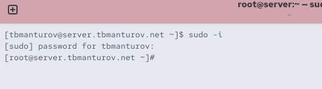{#fig-003 width=70%}

Далее установили необходимые для работы с базами данных пакеты: ```dnf -y install mariadb mariadb-server``` ([рис. @fig-004])

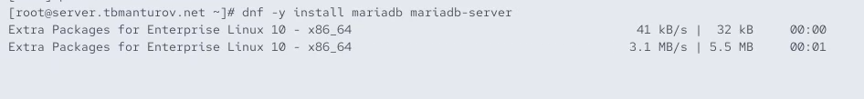{#fig-004 width=70%}

Далее посмотрели конфигурационные файлы mariadb в каталоге */etc/my.cnf.d* и файл */etc/my.cnf* ([рис. @fig-005])

Пояснения к файлам: 

- Файл */etc/my.cnf*:

	+ Основной конфигурационный файл MySQL/MariaDB

	+ Содержит секцию [client-server] для общих настроек клиента и сервера

	+ директива includedir /etc/my.cnf.d - это означает, что файлы из каталога /etc/my.cnf.d подключаются к основной конфигурации

- Файлы в каталоге */etc/my.cnf.d/*:

	+ auth_gssapi.cnf - настройки аутентификации GSSAPI

	+ client.cnf - параметры для клиентских подключений

	+ enable_encryption.preset - предустановки для включения шифрования

	+ mariadb-server.cnf - основные настройки сервера MariaDB

	+ mysql-clients.cnf - настройки для клиентов MySQL

	+ provider_*.cnf - конфигурации различных провайдеров сжатия (bzip2, lz4, lzo, snappy)

	+ spider.cnf - настройки для движка Spider

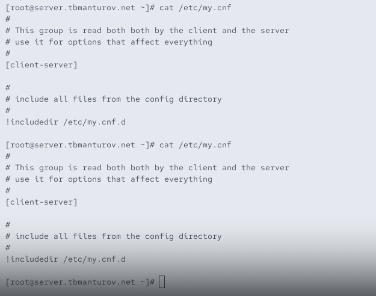{#fig-005 width=70%}

Далее для запуска и включения программного обеспечения mariadb использовали: ```systemctl start mariadb``` и ```systemctl enable mariadb``` ([рис. @fig-006])

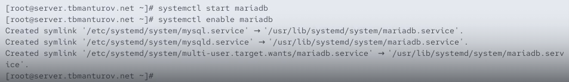{#fig-006 width=70%}

Далее убедились, что mariadb прослушивает порт 3306: ```ss -tulpen | grep mariadb``` ([рис. @fig-007])

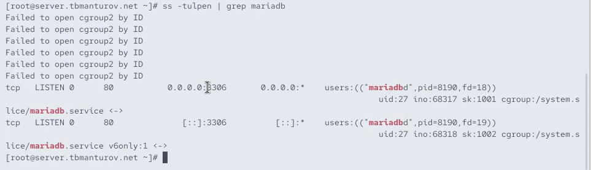{#fig-007 width=70%}

Далее запустили скрипт конфигурации безопасности mariadb: ```mysql_secure_installation```. Установили пароль для пользователя root базы данных, отключили удалённый корневой доступ и удалили тестовую базу данных и любых анонимных пользователей ([рис. @fig-008]), ([рис. @fig-009]), ([рис. @fig-010])

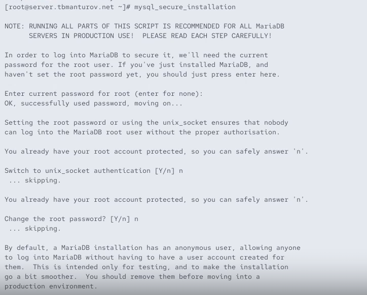{#fig-008 width=70%}

Для входа в базу данных с правами администратора базы данных ввели ```mysql -u root -p``` ([рис. @fig-011])

{#fig-011 width=70%}

Псомотреди список команд MySQL, введя ```\h``` ([рис. @fig-012])

{#fig-012 width=70%}

Из приглашения интерактивной оболочки MariaDB для отображения доступных в настоящее время баз данных ввели MySQL-запрос ```SHOW DATABASES;``` ([рис. @fig-013])

В системе присутствуют вот такие базы данных:

- information_schema - системная БД, содержащая метаданные о всех других базах данных

- mysql - системная БД, хранящая информацию о пользователях, привилегиях и других системных настройках

- performance_schema - системная БД для мониторинга производительности сервера

- sys - системная БД, предоставляющая удобные представления для анализа производительности

Это стандартный набор системных баз данных, которые создаются при первоначальной установке MariaDB/MySQL. Пользовательские базы данных в системе пока что отсутствуют.

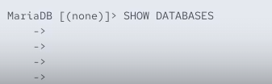{#fig-013 width=70%} 

Для выхода из интерфейса интерактивной оболочки MariaDB ввели ```exit;``` ([рис. @fig-014])

{#fig-014 width=70%}

## Конфигурация кодировки символов

Опять вошли в базу данных с правами администратора ```mysql -u root -p``` ([рис. @fig-015])

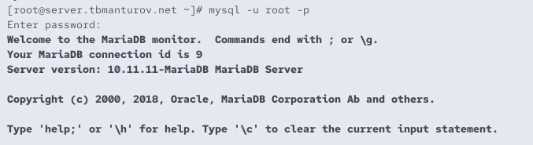{#fig-015 width=70%}

Далее посмотрели статус MariaDB введя ```status``` ([рис. @fig-016])

Пояснения к статусу MariaDB:

- Информация о клиенте:

	+ mysql Ver 15.1 Distrib 10.11.11-MariaDB - версия клиента и сервера MariaDB

	+ for Linux (x86_64) - платформа

- Текущее соединение:

	+ Connection id: 14 - идентификатор соединения

	+ Current database: - нет выбранной БД

	+ Current user: root@localhost - пользователь и хост

	+ SSL: Not in use - SSL не используется

- Серверная информация:

	+ Server: MariaDB - тип СУБД

	+ Server version: 10.11.11-MariaDB - версия сервера

	+ Connection: Localhost via UNIX socket - тип подключения

	+ UNIX socket: /var/lib/mysql/mysql.sock - сокет-файл

- Кодировки:

	+ Server characterset: latin1 - кодировка сервера

	+ Client characterset: utf8mb3 - кодировка клиента

- Статистика сервера:

	+ Uptime: 15 min 12 sec - время работы сервера

	+ Threads: 1 - количество активных потоков

	+ Questions: 27 - выполнено запросов

	+ Queries per second avg: 0.029 - среднее количество запросов в секунду

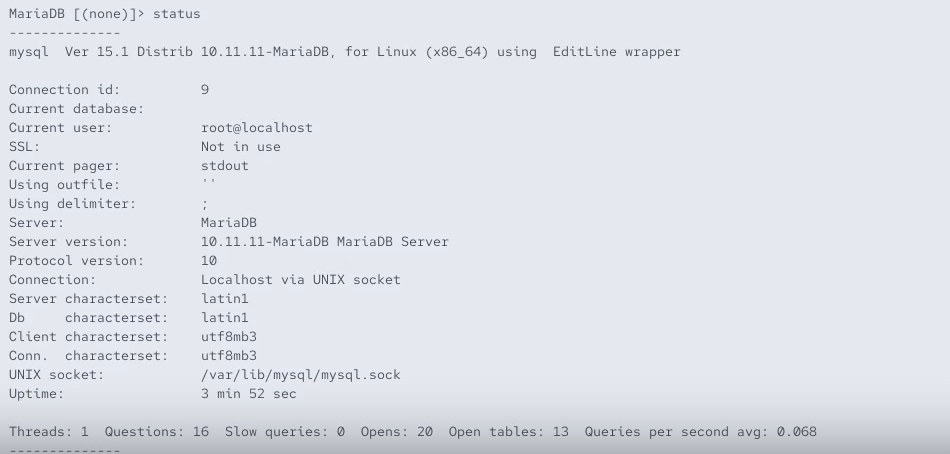{#fig-016 width=70%}

Далее в каталоге */etc/my.cnf.d* создали файл *utf8.cnf* ([рис. @fig-017]): 

```cd /etc/my.cnf.d```

```touch utf8.cnf```

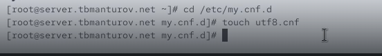{#fig-017 width=70%}

Открыв этот файл на редактирование пропишем в нём следующие строки ([рис. @fig-018]):

```
[client]
default-character-set = utf8
[mysqld]
character-set-server = utf8
```

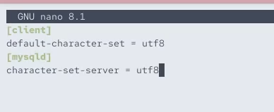{#fig-018 width=70%}

Далее перезапустили MariaDB с помощью ```systemctl restart mariadb``` ([рис. @fig-019])

{#fig-019 width=70%}

Далее опять вошли в базу данных с правами администратора, посмотрели статус MariaDB и поняли что сервер и базы данных теперь используют utf8mb3 вместо latin1, что обеспечивает поддержку Unicode символов и корректное отображение кириллицы и других языков ([рис. @fig-020])

{#fig-020 width=70%}

## Создание базы данных

Опять зашли в базу данных с правами администратора ```mysql -u root -p``` ([рис. @fig-021])

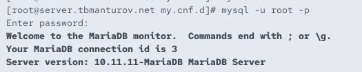{#fig-021 width=70%}

Создали базу данных с именем addressbook: ```CREATE DATABASE addressbook CHARACTER SET utf8 COLLATE utf8_general_ci;``` ([рис. @fig-022])

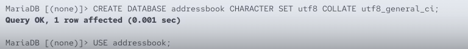{#fig-022 width=70%}

Перешли к базе данных addressbook: ```USE addressbook;``` ([рис. @fig-023])

{#fig-023 width=70%}

Отобразили имеющиеся в базе данных addressbook таблицы: ```SHOW TABLES;``` ([рис. @fig-024])

{#fig-024 width=70%}

Создали таблицу city с полями name и city: ```CREATE TABLE city(name VARCHAR(40), city VARCHAR(40));``` ([рис. @fig-025])

{#fig-025 width=70%}

Заполнили несколько строк таблицы некоторыми данными по аналогии в соответствии с синтаксисом MySQL ([рис. @fig-026]):

```INSERT INTO city(name,city) VALUES ('Иванов','Москва');```

```INSERT INTO city(name,city) VALUES ('Петров','Сочи');```

```INSERT INTO city(name,city) VALUES ('Сидоров','Дубна');```

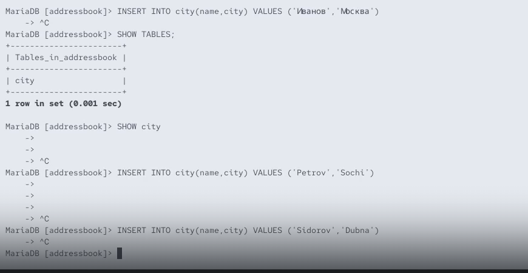{#fig-026 width=70%}
 
Сделали следующий MySQL-запрос: ```SELECT * FROM city;``` ([рис. @fig-027])

Таблица содержит 3 записи с двумя полями name и city:

- Иванов | Москва

- Петров | Сочи

- Сидоров | Дубна 

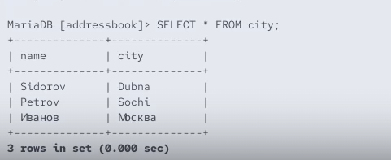{#fig-027 width=70%}

Создали пользователя для работы с базой данных addressbook и задали для него пароль: ```CREATE USER tbmanturov@'%' IDENTIFIED BY 'password';`1234` ([рис. @fig-028])

{#fig-028 width=70%}

Далее предоставили права доступа созданному пользователю tbmanturov на действия с базой
данных addressbook (просмотр, добавление, обновление, удаление данных): ```GRANT SELECT,INSERT,UPDATE,DELETE ON addressbook.* TO tbmanturov@'%';``` ([рис. @fig-029])

{#fig-029 width=70%}

Обновили привилегии (права доступа) базы данных addressbook: ```FLUSH PRIVILEGES;``` ([рис. @fig-030])

{#fig-030 width=70%}

Далее посмотрели общую информацию о табице city базы данных addressbook: ```DESCRIBE city;``` ([рис. @fig-031])

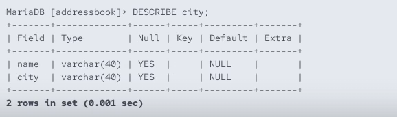{#fig-031 width=70%}

Далее вышли из окружения MariaDB: ```quit``` ([рис. @fig-032])

{#fig-032 width=70%}

Посмотрели список баз данных: ```mysqlshow -u root -p``` ([рис. @fig-033])

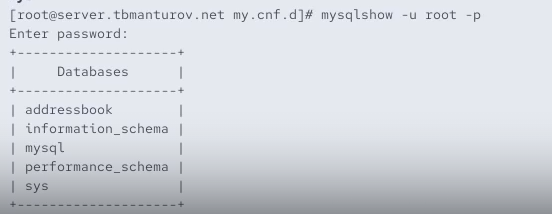{#fig-033 width=70%}

Посмотрели список таблиц базы данных addressbook: ```mysqlshow -u root -p addressbook``` и ```mysqlshow -u tbmanturov -p addressbook``` ([рис. @fig-034]), ([рис. @fig-035])

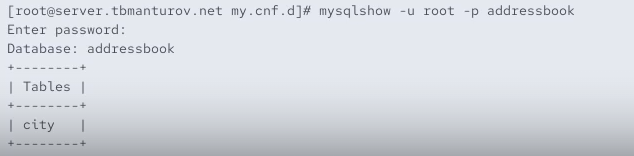{#fig-034 width=70%}

##  Резервные копии

На виртуальной машине server создали каталог для резервных копий: ```mkdir -p /var/backup``` ([рис. @fig-036])

{#fig-036 width=70%}

Далее сделали резервную копию базы данных addressbook, сжатую резервную копию и сжатую резервную копию с указанием даты ([рис. @fig-037]):

```mysqldump -u root -p addressbook > /var/backup/addressbook.sql```

```mysqldump -u root -p addressbook | gzip > /var/backup/addressbook.sql.gz```

```mysqldump -u root -p addressbook | gzip > $(date +/var/backup/addressbook.%Y%m%d.%H%M%S.sql.gz)```

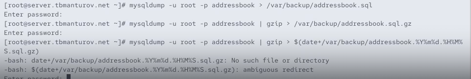{#fig-037 width=70%}

Далее аосстановили базу данных addressbook из резервной копии и из сжатой резервной копии ([рис. @fig-038]):

```mysql -u root -p addressbook < /var/backup/addressbook.sql```

```zcat /var/backup/addressbook.sql.gz | mysql -u root -p addressbook```

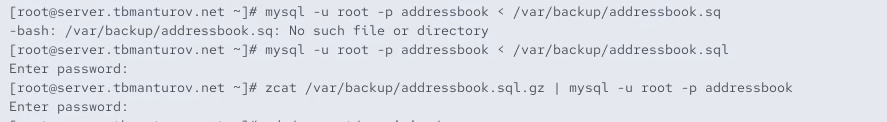{#fig-038 width=70%}

## Внесение изменений в настройки внутреннего окружения виртуальной машины

На виртуальной машине server перешли в каталог для внесения изменений в настройки внутреннего окружения */vagrant/provision/server/*, создали в нём каталог *mysql*, в который поместили в соответствующие подкаталоги конфигурационные файлы MariaDB и резервную копию базы данных addressbook ([рис. @fig-039]):

```cd /vagrant/provision/server```

```mkdir -p /vagrant/provision/server/mysql/etc/my.cnf.d```

```mkdir -p /vagrant/provision/server/mysql/var/backup```

```cp -R /etc/my.cnf.d/utf8.cnf /vagrant/provision/server/mysql/etc/my.cnf.d/```

```cp -R /var/backup/* /vagrant/provision/server/mysql/var/backup/```

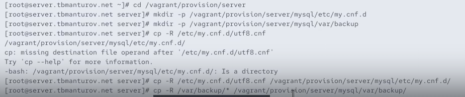{#fig-039 width=70%}

В каталоге /vagrant/provision/server создали исполняемый файл mysql.sh ([рис. @fig-040]):

```cd /vagrant/provision/server```

```touch mysql.sh```

```chmod +x mysql.sh```

{#fig-040 width=70%}

Открыв его на редактирование прописали в нём следующие строки ([рис. @fig-041]):

```
#!/bin/bash
echo "Provisioning script $0"
systemctl restart named
echo "Install needed packages"
dnf -y install mariadb mariadb-server
echo "Copy configuration files"
cp -R /vagrant/provision/server/mysql/etc/* /etc
mkdir -p /var/backup
cp -R /vagrant/provision/server/mysql/var/backup/* /var/backup
echo "Start mysql service"
systemctl enable mariadb
systemctl start mariadb
if [[ ! -d /var/lib/mysql/mysql ]]
then
echo "Securing mariadb"
mysql_secure_installation <<EOF
y
123456
123456
y
y
y
y
EOF
echo "Create database"
mysql -u root -p123456 <<EOF
CREATE DATABASE addressbook CHARACTER SET utf8 COLLATE utf8_general_ci;
EOF
mysql -u root -p123456 addressbook < /var/backup/addressbook.sql
fi
```

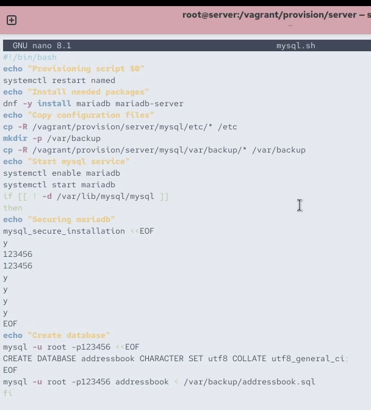{#fig-041 width=70%}

Этот скрипт повторяет произведённые вами действия по установке и настройке сервера баз данных 

Для отработки созданного скрипта во время загрузки виртуальных машин в конфигурационном файле Vagrantfile необходимо добавить в конфигурации сервера следующую запись ([рис. @fig-042]):

```
server.vm.provision "server mysql",
	type: "shell",
	preserve_order: true,
	path: "provision/server/mysql.sh"
```

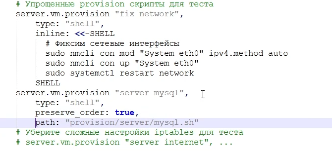{#fig-042 width=70%}

## Контрольные вопросы + ответы

1. Какая команда отвечает за настройки безопасности в MariaDB?

Настройки безопасности в MariaDB обычно управляются с
помощью команды mysql_secure_installation. Эта команда выполняет несколько шагов, включая установку пароля для пользователя root, удаление анонимных учетных записей, отключение удаленного входа для пользователя root и удаление тестовых баз данных.

2. Как настроить MariaDB для доступа через сеть?

Для настройки MariaDB для доступа через сеть, вы можете отредактировать файл конфигурации MariaDB (обычно называемый my.cnf) и убедиться, что параметр bind-address установлен на IP-адрес, доступный в вашей сети. Также, убедитесь, что пользователь имеет права доступа извне, например, с использованием команды GRANT.

3. Какая команда позволяет получить обзор доступных баз данных после входа в среду оболочки MariaDB?

Обзор доступных баз данных после входа в среду оболочки MariaDB можно получить с помощью команды SHOW DATABASES;.

4. Какая команда позволяет узнать, какие таблицы доступны в базе данных?

Для просмотра доступных таблиц в базе данных используйте команду SHOW TABLES;.

5. Какая команда позволяет узнать, какие поля доступны в таблице?

Чтобы узнать, какие поля доступны в таблице, используйте команду DESCRIBE table_name; или SHOW COLUMNS FROM table_name;.

6. Какая команда позволяет узнать, какие записи доступны в таблице?

Для просмотра записей в таблице можно использовать команду SELECT * FROM table_name;.

7. Как удалить запись из таблицы?

Для удаления записи из таблицы используйте команду DELETE FROM table_name WHERE condition;, где condition - условие, определяющее, какие записи следует удалить

8. Где расположены файлы конфигурации MariaDB? Что можно настроить с их помощью?

Файлы конфигурации MariaDB обычно располагаются в различных местах в зависимости от системы, но основной файл - my.cnf. Он может быть в /etc/my.cnf, /etc/mysql/my.cnf или /usr/etc/my.cnf. С помощью этих файлов можно настроить различные параметры, такие как порт, пути к файлам данных, параметры безопасности и другие.

9. Где располагаются файлы с базами данных MariaDB?

Файлы с базами данных MariaDB располагаются в директории данных. Обычно это /var/lib/mysql/ на Linux-системах.

10. Как сделать резервную копию базы данных и затем её восстановить?

Для создания резервной копии базы данных используйте команду mysqldump. Например, mysqldump -u username -p dbname > backup.sql. Для восстановления базы данных из резервной копии используйте команду mysql -u username -p dbname < backup.sql.

# Выводы

В ходе выполнения лабораторной работы №6 мы приобрели практические навыки по установке и конфигурированию системы управления базами данных на примере программного обеспечения MariaDB.

# Список литературы

1. [Лаборатораня работа №6](https://esystem.rudn.ru/pluginfile.php/2854752/mod_resource/content/6/006-mysql.pdf)
