---
# Preamble

## Author
author:
  name: Мантуров Татархан Бесланович
  degrees: DSc
  orcid: 0000-0002-0877-7063
  email: kulyabov-ds@rudn.ru
  affiliation:
    - name: Российский университет дружбы народов
      country: Российская Федерация
      postal-code: 117198
      city: Москва
      address: ул. Миклухо-Маклая, д. 6
## Title
title: "Отчёт по лабораторной работе №7"
subtitle: "Дисциплина: Администрирование сетевых подсистем"
license: "CC BY"
## Generic options
lang: ru-RU
number-sections: true
toc: true
toc-title: "Содержание"
toc-depth: 2
## Crossref customization
crossref:
  lof-title: "Список иллюстраций"
  lot-title: "Список таблиц"
  lol-title: "Листинги"
## Bibliography
bibliography:
  - bib/cite.bib
csl: _resources/csl/gost-r-7-0-5-2008-numeric.csl
## Formats
format:
### Pdf output format
  pdf:
    toc: true
    number-sections: true
    colorlinks: false
    toc-depth: 2
    lof: true # List of figures
    lot: true # List of tables
#### Document
    documentclass: scrreprt
    papersize: a4
    fontsize: 12pt
    linestretch: 1.5
#### Language
    babel-lang: russian
    babel-otherlangs: english
#### Biblatex
    cite-method: biblatex
    biblio-style: gost-numeric
    biblatexoptions:
      - backend=biber
      - langhook=extras
      - autolang=other*
#### Misc options
    csquotes: true
    indent: true
    header-includes: |
      \usepackage{indentfirst}
      \usepackage{float}
      \floatplacement{figure}{H}
      \usepackage[math,RM={Scale=0.94},SS={Scale=0.94},SScon={Scale=0.94},TT={Scale=MatchLowercase,FakeStretch=0.9},DefaultFeatures={Ligatures=Common}]{plex-otf}
### Docx output format
  docx:
    toc: true
    number-sections: true
    toc-depth: 2
---

# Цель работы

Целью данной работы является получение навыков настройки межсетевого экрана в Linux в части переадресации портов и настройки Masquerading.

# Задание

1. Настроить межсетевой экран виртуальной машины server для доступа к серверу по протоколу SSH не через 22-й порт, а через порт 2022 
2. Настроить Port Forwarding на виртуальной машине server
3. Настроить маскарадинг на виртуальной машине server для организации доступа клиента к сети Интернет 
4. Написать скрипт для Vagrant, фиксирующий действия по расширенной настройке межсетевого экрана. Соответствующим образом внести изменения в Vagrantfile

# Выполнение лабораторной работы

## Создание пользовательской службы firewalld

Загрузили нашу операционную систему и перешли в рабочий каталог с проектом: ```cd /var/tmp/tbmanturov/vagrant``` ([рис. @fig-001])

Запустили виртуальную машину server: ```make server-up``` ([рис. @fig-002]) 

Далее на виртуальной машине server вошли под созданным нами в предыдущей работе пользователем и открыли терминал. Перешли в режим суперпользователя: ```sudo -i``` ([рис. @fig-003])

Далее на основе существующего файла описания службы ssh создали файл с собственным описанием: ```cp /usr/lib/firewalld/services/ssh.xml /etc/firewalld/services/ssh-custom.xml``` ([рис. @fig-004])

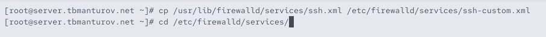{#fig-004 width=70%}

Далее посмотрели содержимое файла службы: ```cat /etc/firewalld/services/ssh-custom.xml```([рис. @fig-005])

Пояснения к файлу службы: 

- ```<?xml ...?>``` — объявление XML-документа, версия и кодировка.

- ```<service>``` — корневой элемент, описывающий службу.

- ```<short>``` — краткое название службы (например, "SSH").

- ```<description>``` — подробное описание назначения службы.

- ```<port protocol="..." port="..."/>``` — указание протокола и порта службы (здесь TCP/22).

Файл используется для настройки правил firewall (например, в firewalld) для разрешения доступа к службе.

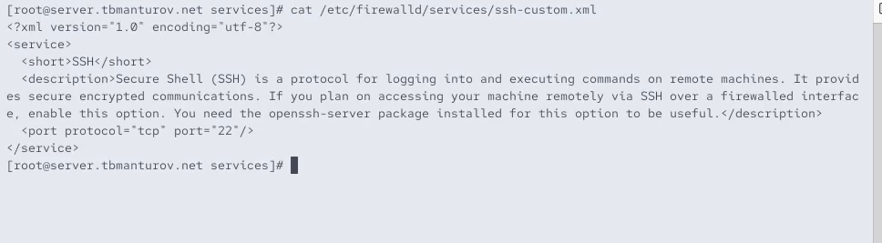{#fig-005 width=70%}

Далее открыли файл описания службы на редактирование и заменили порт 22 на новый порт (2022): ```<port protocol="tcp" port="2022"/>```. В этом же файле скорректировали описание службы, указал что это модифицированный файл службы ([рис. @fig-006])

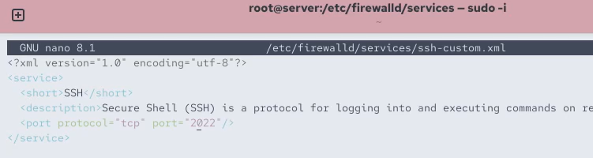{#fig-006 width=70%}

Посмотрели список доступных FirewallD служб: ```firewall-cmd --get-services``` ([рис. @fig-007])

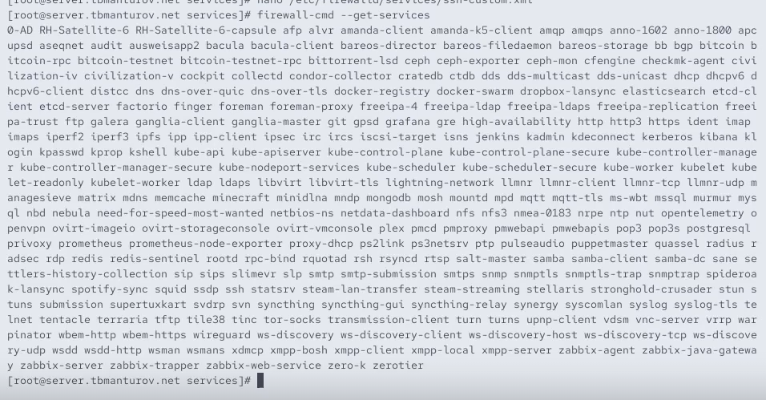{#fig-007 width=70%}

Далее перезагрузили правила межсетевого экрана с сохранением информации о состоянии и вновь вывели на экран список служб, а также список активных служб ([рис. @fig-008]):

```firewall-cmd --reload```

```firewall-cmd --get-services```

```firewall-cmd --list-services```

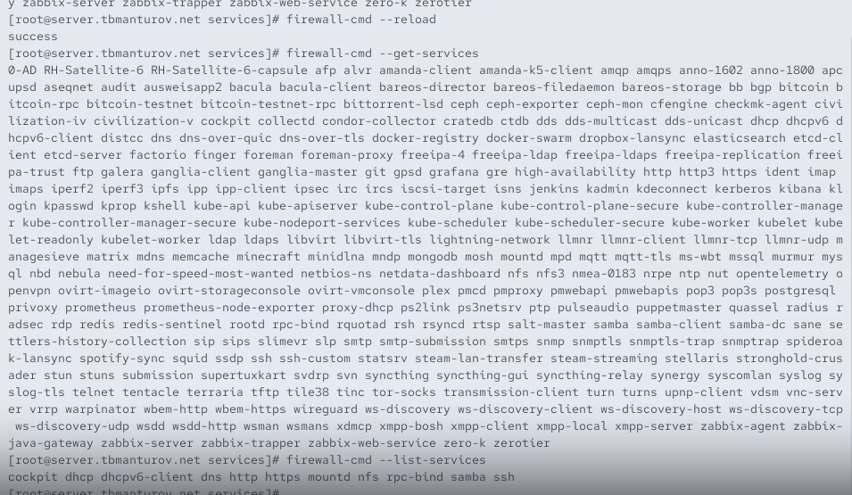{#fig-008 width=70%}

Добавили новую службу в FirewallD и вывели на экран список активных служб ([рис. @fig-009]):

```firewall-cmd --add-service=ssh-custom```

```firewall-cmd --list-services```

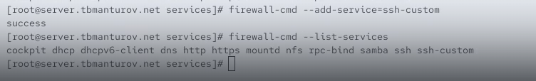{#fig-009 width=70%}

Служба успешно добавлена в FirewallD, поэтому мы перезагрузили правила межсетевого экрана с сохранением информации о состоянии ([рис. @fig-010]):

```firewall-cmd --add-service=ssh-custom --permanent```

```firewall-cmd --reload```

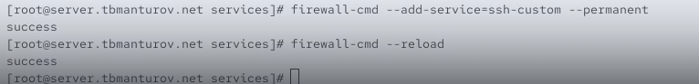{#fig-010 width=70%}

## Перенаправление портов

Далее организовли на сервере переадресацию с порта 2022 на порт 22: ```firewall-cmd --add-forward-port=port=2022:proto=tcp:toport=22``` ([рис. @fig-011])

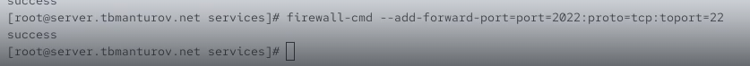{#fig-011 width=70%}

На клиенте попробовали получить доступ по SSH к серверу через порт 2022: ```ssh -p 2022 tbmanturov@server.tbmanturov.net``` ([рис. @fig-012]), ([рис. @fig-013])

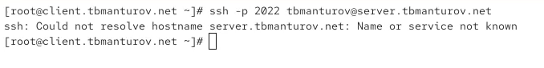{#fig-013 width=70%}

## Настройка Port Forwarding и Masquerading

На сервере посмотрели, активирована ли в ядре системы возможность перенаправления IPv4-пакетов: ```sysctl -a | grep forward``` ([рис. @fig-014])

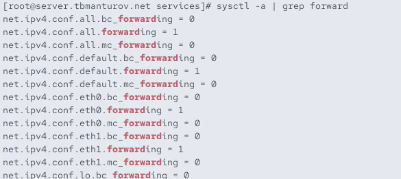{#fig-014 width=70%}

Далее включили перенаправление IPv4-пакетов на сервере ([рис. @fig-015]):

```echo "net.ipv4.ip_forward = 1" > /etc/sysctl.d/90-forward.conf```

```sysctl -p /etc/sysctl.d/90-forward.conf```

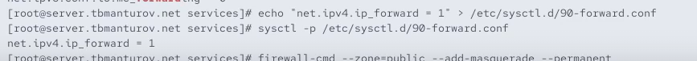{#fig-015 width=70%}

Включили маскарадинг на сервере ([рис. @fig-016]):

```firewall-cmd --zone=public --add-masquerade --permanent```

```firewall-cmd --reload```

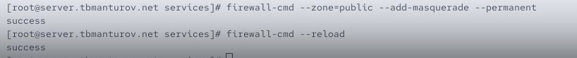{#fig-016 width=70%}

Далее на клиенте проверили доступность выхода в Интернет ([рис. @fig-017])

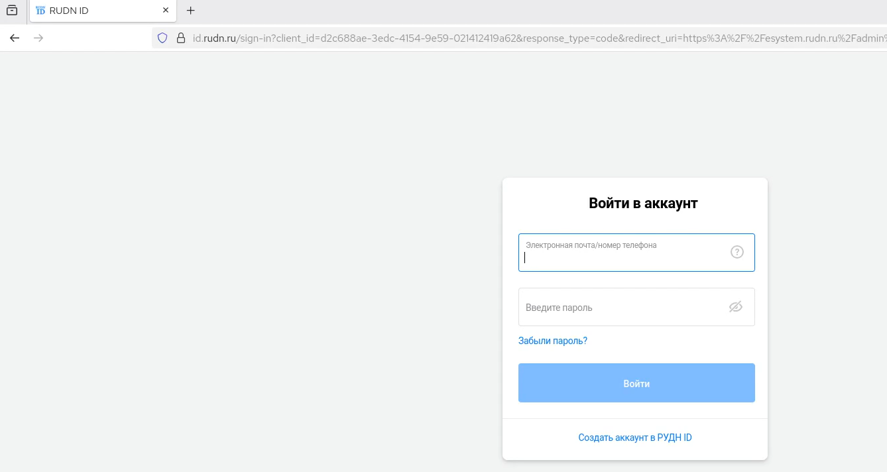{#fig-017 width=70%}

## Внесение изменений в настройки внутреннего окружения виртуальной машины

На виртуальной машине server перешли в каталог для внесения изменений в настройки внутреннего окружения */vagrant/provision/server/*, создали в нём каталог *firewall*, в который поместили в соответствующие подкаталоги конфигурационные файлы FirewallD ([рис. @fig-018]):

```cd /vagrant/provision/server```

```mkdir -p /vagrant/provision/server/firewall/etc/firewalld/services```

```mkdir -p /vagrant/provision/server/firewall/etc/sysctl.d```

```cp -r /etc/firewalld/services/ssh-custom.xml /vagrant/provision/server/firewall/etc/firewalld/services/```

```cp -r /etc/sysctl.d/90-forward.conf /vagrant/provision/server/firewall/etc/sysctl.d/```

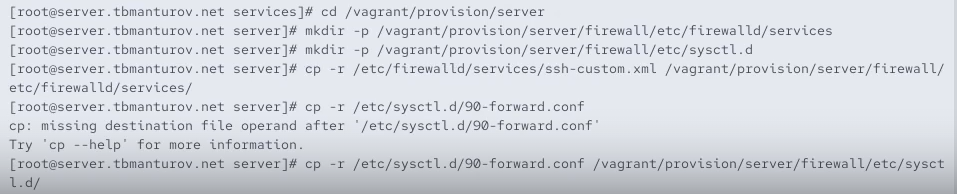{#fig-018 width=70%}

В каталоге /vagrant/provision/server создали исполняемый файл firewall.sh ([рис. @fig-019]):

```cd /vagrant/provision/server```

```touch firewall.sh```

```chmod +x firewall.sh```

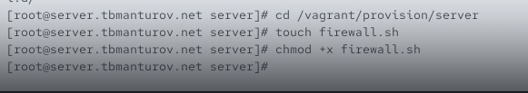{#fig-019 width=70%}

Открыв его на редактирование прописали в нём следующие строки ([рис. @fig-020]):

```
#!/bin/bash
echo "Provisioning script $0"
echo "Copy configuration files"
cp -R /vagrant/provision/server/firewall/etc/* /etc
echo "Configure masquerading"
firewall-cmd --add-service=ssh-custom --permanent
firewall-cmd --add-forward-port=port=2022:proto=tcp:toport=22 --permanent
firewall-cmd --zone=public --add-masquerade --permanent
firewall-cmd --reload
restorecon -vR /etc
```

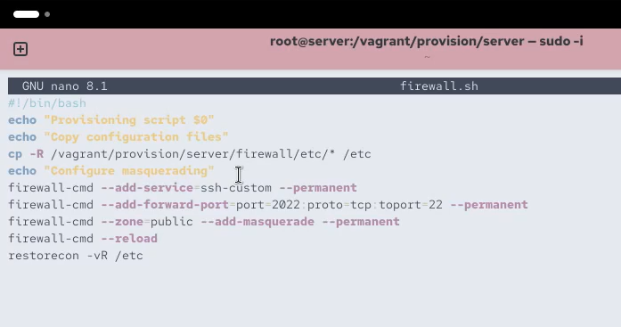{#fig-020 width=70%}

Этот скрипт повторяет произведённые нами действия по настройке межсетвеого экрана в части переадресации портов и настройки Masquerading

Для отработки созданного скрипта во время загрузки виртуальных машин в конфигурационном файле Vagrantfile необходимо добавить в конфигурации сервера следующую запись ([рис. @fig-021]):

```
server.vm.provision "server firewall",
	type: "shell",
	preserve_order: true,
	path: "provision/server/firewall.sh""
```

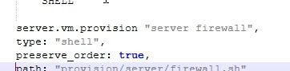{#fig-021 width=70%}

После этого можно выключать виртуальные машины server и client: ```make server-halt``` и ```make client-halt```([рис. @fig-022])

## Контрольные вопросы + ответы

1. Где хранятся пользовательские файлы firewalld?

В firewalld пользовательские файлы хранятся в директории /etc/firewalld/

2. Какую строку надо включить в пользовательский файл службы, чтобы указать порт TCP 2022?

Для указания порта TCP 2022 в пользовательском файле службы, можно добавить строку в
секцию port следующим образом: <port protocol="tcp" port="2022"/>

3. Какая команда позволяет вам перечислить все службы, доступные в настоящее время на вашем сервере?

Чтобы перечислить все службы, доступные в настоящее время на сервере с использованием firewalld, используется команда: firewall-cmd --get-services

4. В чем разница между трансляцией сетевых адресов (NAT) и маскарадингом (masquerading)?

Разница между трансляцией сетевых адресов (NAT) и маскарадингом (masquerading) заключается в том, что в случае NAT исходный IP-адрес пакета заменяется на IP-адрес маршрутизатора, а в случае маскарадинга используется IP-адрес интерфейса маршрутизатора.

5. Какая команда разрешает входящий трафик на порт 4404 и перенаправляет его в службу ssh по IP-адресу 10.0.0.10?

Для разрешения входящего трафика на порт 4404 и перенаправления его на службу SSH по IP-адресу 10.0.0.10, можно использовать команды:

- firewall-cmd --zone=public --add-port=4404/tcp --permanent

- firewall-cmd --zone=public --add-forward-

- port=port=4404:proto=tcp:toport=22:toaddr=10.0.0.10 --permanent

- firewall-cmd --reload

6. Какая команда используется для включения маcкарадинга IP-пакетов для всех пакетов, выходящих в зону public?

Для включения маскарадинга IP-пакетов для всех пакетов, выходящих в зону public, можно использовать команды:

- firewall-cmd --zone=public --add-masquerade --permanent

- firewall-cmd --reload

# Выводы

В ходе выполнения лабораторной работы №7 мы получили навыки настройки межсетевого экрана в Linux в части переадресации портов и настройки Masquerading. 

# Список литературы

1. [Лаборатораня работа №7](https://esystem.rudn.ru/pluginfile.php/2854758/mod_resource/content/5/007-firewall.pdf)
