---
# Preamble

## Author
author:
  name: Мантуров Татархан Бесланович
  degrees: DSc
  orcid: 0000-0002-0877-7063
  email: kulyabov-ds@rudn.ru
  affiliation:
    - name: Российский университет дружбы народов
      country: Российская Федерация
      postal-code: 117198
      city: Москва
      address: ул. Миклухо-Маклая, д. 6
## Title
title: "Отчёт по лабораторной работе №8"
subtitle: "Дисциплина: Администрирование сетевых подсистем"
license: "CC BY"
## Generic options
lang: ru-RU
number-sections: true
toc: true
toc-title: "Содержание"
toc-depth: 2
## Crossref customization
crossref:
  lof-title: "Список иллюстраций"
  lot-title: "Список таблиц"
  lol-title: "Листинги"
## Bibliography
bibliography:
  - bib/cite.bib
csl: _resources/csl/gost-r-7-0-5-2008-numeric.csl
## Formats
format:
### Pdf output format
  pdf:
    toc: true
    number-sections: true
    colorlinks: false
    toc-depth: 2
    lof: true # List of figures
    lot: true # List of tables
#### Document
    documentclass: scrreprt
    papersize: a4
    fontsize: 12pt
    linestretch: 1.5
#### Language
    babel-lang: russian
    babel-otherlangs: english
#### Biblatex
    cite-method: biblatex
    biblio-style: gost-numeric
    biblatexoptions:
      - backend=biber
      - langhook=extras
      - autolang=other*
#### Misc options
    csquotes: true
    indent: true
    header-includes: |
      \usepackage{indentfirst}
      \usepackage{float}
      \floatplacement{figure}{H}
      \usepackage[math,RM={Scale=0.94},SS={Scale=0.94},SScon={Scale=0.94},TT={Scale=MatchLowercase,FakeStretch=0.9},DefaultFeatures={Ligatures=Common}]{plex-otf}
### Docx output format
  docx:
    toc: true
    number-sections: true
    toc-depth: 2
---

# Цель работы

Целью данной работы является приобретение практических навыков по установке и конфигурированию SMTP-сервера.

# Задание

1. Установить на виртуальной машине server SMTP-сервер postfix
2. Сделать первоначальную настройку postfix при помощи утилиты postconf, задав отправку писем не на локальный хост, а на сервер в домене
3. Проверить отправку почты с сервера и клиента
4. Сконфигурировать Postfix для работы в домене. Проверить отправку почты с сервера и клиента 
5. Написать скрипт для Vagrant, фиксирующий действия по установке и настройке Postfix во внутреннем окружении виртуальной машины server. Соответствующим образом внести изменения в Vagrantfile

# Выполнение лабораторной работы

## Установка Postfix

Загрузили нашу операционную систему и перешли в рабочий каталог с проектом: ```cd /var/tmp/tbmanturov/vagrant``` ([рис. @fig-001])

Запустили виртуальную машину server: ```make server-up``` ([рис. @fig-002]) 

Далее на виртуальной машине server вошли под созданным нами в предыдущей работе пользователем и открыли терминал. Перешли в режим суперпользователя: ```sudo -i``` ([рис. @fig-003])

Далее установили необходимые для работы пакеты ([рис. @fig-004]), ([рис. @fig-005]):

```dnf -y install postfix```

```dnf -y install s-nail```

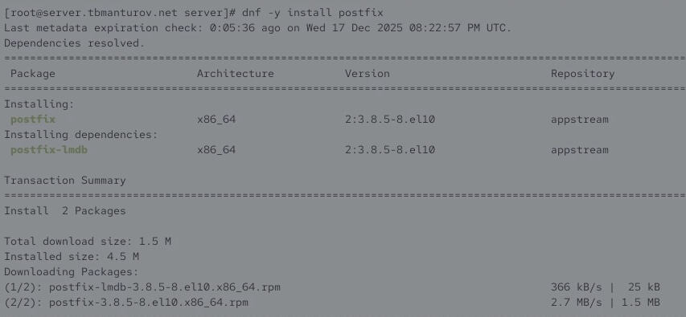{#fig-004 width=70%}

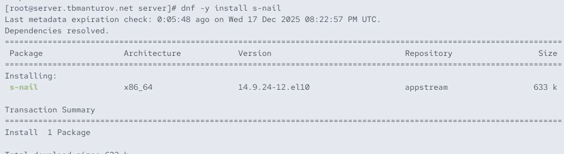{#fig-005 width=70%}

Далее сконфигурировали межсетевой экран, разрешив работать службе протокола SMTP ([рис. @fig-006]):

```firewall-cmd --add-service=smtp```

```firewall-cmd --add-service=smtp --permanent```

```firewall-cmd --list-services```

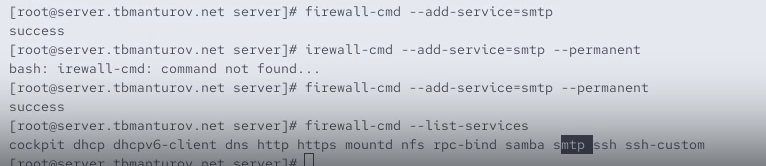{#fig-006 width=70%}

Восстановили контекст безопасности в SELinux: ```restorecon -vR /etc``` ([рис. @fig-007])

Далее запустили Postfix ([рис. @fig-008]):

```systemctl enable postfix```

```systemctl start postfix```

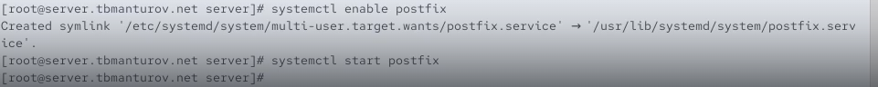{#fig-008 width=70%}

## Изменение параметров Postfix с помощью postconf

Для просмотра списка текущих настроек Postfix ввели: ```postconf``` ([рис. @fig-009])

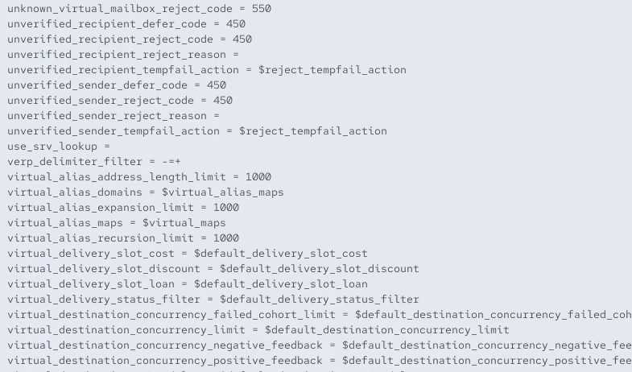{#fig-009 width=70%}

Посмотрели текущее значение параметра myorigin: ```postconf myorigin``` ([рис. @fig-010])

Посмотрели текущее значение параметра mydomain: ```postconf mydomain```. Должно быть указано mydomain = user.net ([рис. @fig-011])

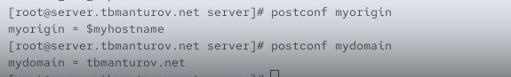{#fig-011 width=70%}

Далее заменили значение параметра myorigin на значение параметра mydomain: ```.postconf -e ‘myorigin = $mydomain’``` ([рис. @fig-012])

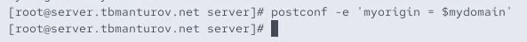{#fig-012 width=70%}

Повторили команду ```postconf myorigin``` и убедились, что замена параметра была произведена ([рис. @fig-013])

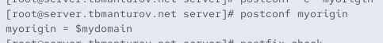{#fig-013 width=70%}

Далее провериои корректность содержания конфигурационного файла main.cf: ```postfix check``` ([рис. @fig-014])

Перезагрузили конфигурационные файлы Postfix: ```systemctl reload postfix``` ([рис. @fig-015])

Посмотрели все параметры с значением, отличным от значения по умолчанию: ```postconf -n``` ([рис. @fig-016])

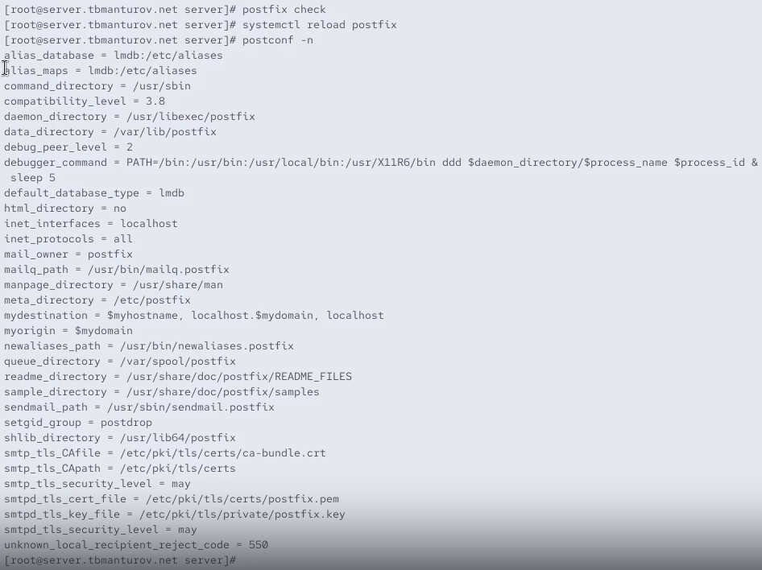{#fig-016 width=70%}

Задали жёстко значение домена: postconf -e 'mydomain = tbmanturov.net' ([рис. @fig-017])

{#fig-017 width=70%}

Далее отключили IPv6 в списке разрешённых в работе Postfix протоколов и оставили только IPv4 ([рис. @fig-018]):

```postconf inet_protocols```

```postconf -e 'inet_protocols = ipv4'```

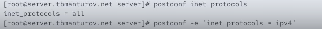{#fig-018 width=70%}

Далее перезагрузили конфигурацию Postfix ([рис. @fig-019]):

```postfix check```

```systemctl reload postfix```

{#fig-019 width=70%}

## Проверка работы Postfix

На сервере под учётной записью пользователя отправили себе письмо, используя утилиту mail: ```echo .| mail -s test1 tbmanturov@server.tbmanturov.net``` ([рис. @fig-020])

{#fig-020 width=70%}

Далее запустили мониторинг работы почтовой службы и посмотрели, что произошло с нашим сообщением: ```tail -f /var/log/maillog``` ([рис. @fig-021])

Сообщение доставлено успешно. Вывод основан на строке лога: ```Oct 19 17:07:49 server postfix/local[11192]: 47546235E86F: to<tbmanturov@server.tbmanturov.net>, relay=local, delay=0.08, delays=0.05/0.02/0/0.01, dsn=2.0.0, status=sent (delivered to mailbox)```

Ключевые показатели доставки:

- status=sent — статус "отправлено"

- (delivered to mailbox) — указание на доставку в почтовый ящик

- dsn=2.0.0 — код успешной доставки (2.X.X означает успех)

{#fig-021 width=70%}

Также дополнительно посмотрели содержание каталога */var/spool/mail* на предмет того, появился ли там каталог вашего пользователя с отправленным письмом

Далее загрузили виртуальную машину client, вошли под нашим пользователем и открыли терминал. Там перешли в режим суперпользователя 

На клиенте установили необходимые для работы пакеты ([рис. @fig-025]), ([рис. @fig-026]):

```dnf -y install postfix```

```dnf -y install s-nail```

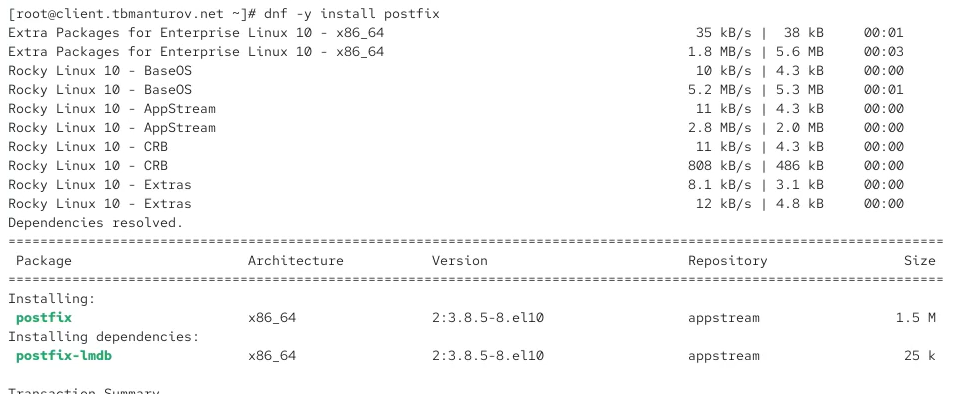{#fig-025 width=70%}

{#fig-026 width=70%}

Далее на клиенте отключили IPv6 в списке разрешённых в работе Postfix протоколов и оставили только IPv4 ([рис. @fig-027]):

```postconf inet_protocols```

```postconf -e 'inet_protocols = ipv4'```

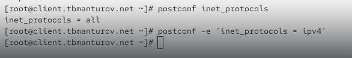{#fig-027 width=70%}

На клиенте запустили Postfix [рис. @fig-028]):

```systemctl enable postfix```

```systemctl start postfix```

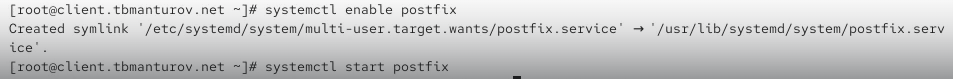{#fig-028 width=70%}

Далее на клиенте под учётной записью пользователя аналогичным образом отправили себе второе письмо, используя утилиту mail: ```echo .| mail -s test1 tbmanturov@client.tbmanturov.net``` ([рис. @fig-029])

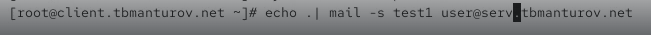{#fig-029 width=70%}

В обоих случаях сообщения были успешно доставлены в локальные почтовые ящики соответствующих узлов (сервера и клиента). Процесс доставки идентичен - сообщение обрабатывается локальной почтовой системой Postfix и помещается в mailbox получателя ([рис. @fig-030])

{#fig-030 width=70%}

Далее на сервере в конфигурации Postfix посмотрели значения параметров сетевых интерфейсов inet_interfaces и сетевых адресов mynetworks ([рис. @fig-032]):

```postconf inet_interfaces```

```postconf mynetworks```

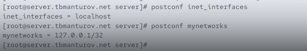{#fig-032 width=70%}

Разрешили Postfix прослушивать соединения не только с локального узла, но и с других интерфейсов сети: ```postconf -e 'inet_interfaces = all'``` ([рис. @fig-033])

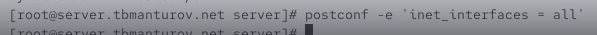{#fig-033 width=70%}

Добавили адрес внутренней сети, разрешив таким образом пересылку сообщений между узлами сети:
```postconf -e 'mynetworks = 127.0.0.0/8, 192.168.0.0/16'``` ([рис. @fig-034])

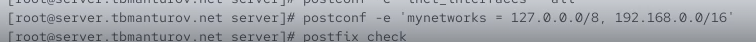{#fig-034 width=70%}

Перезагрузили конфигурацию Postfix и перезапустили Postfix ([рис. @fig-035]):

```postfix check```

```systemctl reload postfix```

```systemctl stop postfix```

```systemctl start postfix```

{#fig-035 width=70%}	

Повторили отправку сообщения с клиента ([рис. @fig-036]), ([рис. @fig-037])

{#fig-036 width=70%}

## Конфигурация Postfix для домена

С клиента отправили письмо на свой доменный адрес: ```echo .| mail -s test2  tbmanturov@tbmanturov.net``` ([рис. @fig-040])

{#fig-040 width=70%}

Запустили мониторинг работы почтовой службы и посмотрели, что произошло с нашим сообщением: ```tail -f /var/log/maillog```. Сообщение было успешно отправлено ([рис. @fig-041])

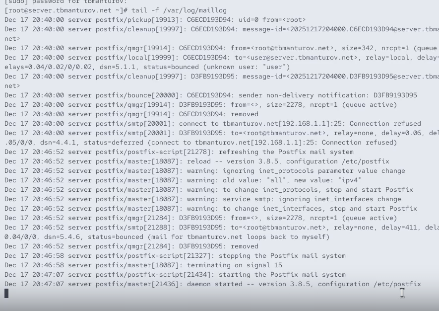{#fig-041 width=70%}

Дополнительно посмотрели, какие сообщения ожидают в очереди на отправление: ```postqueue -p``` ([рис. @fig-042])

{#fig-042 width=70%}

Далее для настройки возможности отправки сообщений не на конкретный узел сети, а на доменный адрес прописали MX-запись с указанием имени почтового сервера mail.tbmanturov.net в файле прямой DNS-зоны ([рис. @fig-043]): 

```
$ORIGIN .
$TTL 86400	; 1 day
tbmanturov.net	IN SOA	tbmanturov.net. server.tbmanturov.net. (
				2025091616 ; serial
				86400      ; refresh (1 day)
				3600       ; retry (1 hour)
				604800     ; expire (1 week)
				10800      ; minimum (3 hours)
				)
			NS	tbmanturov.net.
			A	192.168.1.1
			MX 10	mail.tbmanturov.net.
$ORIGIN tbmanturov.net.
$TTL 1200	; 20 minutes
client			A	192.168.1.30
			DHCID	( AAEBZz0V+2znOOiQhKjraGVJGIC+vNR42A5PSQ44jxYr
				9w0= ) ; 1 1 32
$TTL 86400	; 1 day
dhcp			A	192.168.1.1
ns			A	192.168.1.1
server			A	192.168.1.1
www			A	192.168.1.1
mail			A	192.168.1.1
```

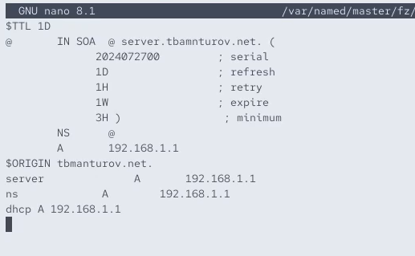{#fig-043 width=70%}

и в файле обратной DNS-зоны ([рис. @fig-044]):

```
$ORIGIN .
$TTL 86400	; 1 day
1.168.192.in-addr.arpa	IN SOA	1.168.192.in-addr.arpa. server.tbmanturov.net. (
				2025091611 ; serial
				86400      ; refresh (1 day)
				3600       ; retry (1 hour)
				604800     ; expire (1 week)
				10800      ; minimum (3 hours)
				)
			NS	1.168.192.in-addr.arpa.
			A	192.168.1.1
			PTR	server.tbmanturov.net.
			MX 10	mail.tbmanturov.net.
$ORIGIN 1.168.192.in-addr.arpa.
$TTL 1200	; 20 minutes
1			PTR	server.tbmanturov.net.
			PTR	ns.tbmanturov.net.
			PTR	dhcp.tbmanturov.net.
			PTR	www.tbmanturov.net.
30			PTR	client.tbmanturov.net.
			DHCID	( AAEBZz0V+2znOOiQhKjraGVJGIC+vNR42A5PSQ44jxYr
				9w0= ) ; 1 1 32
1			PTR	mail.tbmanturov.net.
```

{#fig-044 width=70%}

В конфигурации Postfix добавили домен в список элементов сети, для которых данный сервер является конечной точкой доставки почты: ```postconf -e 'mydestination = $myhostname, localhost.$mydomain, localhost, $mydomain'``` ([рис. @fig-045])

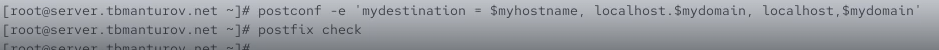{#fig-045 width=70%}

Перезагрузили конфигурацию Postfix ([рис. @fig-046]):

```postfix check```

```systemctl reload postfix```

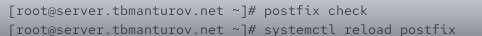{#fig-046 width=70%}

Далее восстановили контекст безопасности в SELinux ([рис. @fig-047]): 

```restorecon -vR /etc```

```restorecon -vR /var/named```

Перезапустили DNS: ```systemctl restart named``` ([рис. @fig-048])

Попробовали отправить сообщения, находящиеся в очереди на отправление: ```postqueue -f``` ([рис. @fig-049])

{#fig-049 width=70%}

Далее проверили отправку почты с клиента на доменный адрес

Сообщение было успешно отправлено. После настройки MX-записи в DNS система стала использовать корректный механизм маршрутизации почты через почтовый сервер mail.tbmanturov.net, а не прямое обращение к домену.

## Внесение изменений в настройки внутреннего окружения виртуальной машины

На виртуальной машине server перешлм в каталог для внесения изменений в настройки внутреннего окружения */vagrant/provision/server/* и замените конфигурационные файлы DNS-сервера ([рис. @fig-052]):

```cd /vagrant/provision/server/dns/var/named```

```cp -R /var/named/* /vagrant/provision/server/dns/var/named```

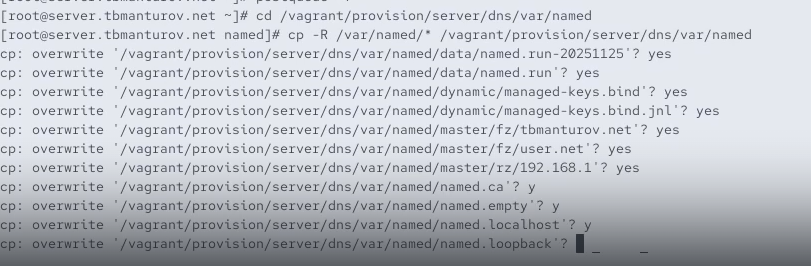{#fig-052 width=70%}

В каталоге */vagrant/provision/server* создали исполняемый файл *mail.sh* ([рис. @fig-053]):

```cd /vagrant/provision/server```

```touch mail.sh```

```chmod +x mail.sh```

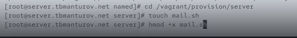{#fig-053 width=70%}

Открыв его на редактирование прописали в нём следующий скрипт ([рис. @fig-054]):

```
#!/bin/bash
echo "Provisioning script $0"
echo "Install needed packages"
dnf -y install postfix
dnf -y install s-nail
echo "Copy configuration files"
#cp -R /vagrant/provision/server/mail/etc/* /etc
echo "Configure firewall"
firewall-cmd --add-service=smtp --permanent
firewall-cmd --reload
restorecon -vR /etc
echo "Start postfix service"
systemctl enable postfix
systemctl start postfix
echo "Configure postfix"
postconf -e 'mydomain = user.net'
postconf -e 'myorigin = $mydomain'
postconf -e 'inet_protocols = ipv4'
postconf -e 'inet_interfaces = all'
postconf -e 'mydestination = $myhostname, localhost.$mydomain, localhost, $mydomain'
postconf -e 'mynetworks = 127.0.0.0/8, 192.168.0.0/16'
postfix set-permissions
restorecon -vR /etc
systemctl stop postfix
systemctl start postfix
```

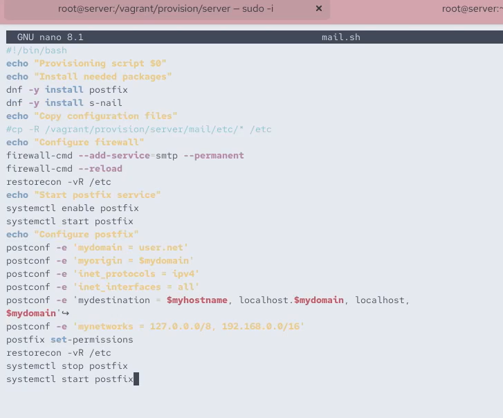{#fig-054 width=70%}

На виртуальной машине client перешли в каталог для внесения изменений в настройки внутреннего окружения */vagrant/provision/client/* и создали исполняемый файл *mail.sh* ([рис. @fig-055]): 

```cd /vagrant/provision/client```

```touch mail.sh```

```chmod +x mail.sh```

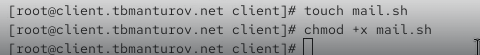{#fig-055 width=70%}

Открыв его на редактирование прописали в нём следующий скрипт ([рис. @fig-056]):

```
#!/bin/bash
echo "Provisioning script $0"
echo "Install needed packages"
dnf -y install postfix
dnf -y install s-nail
echo "Configure postfix"
postconf -e 'inet_protocols = ipv4'
echo "Start postfix service"
systemctl enable postfix
systemctl start postfix
```

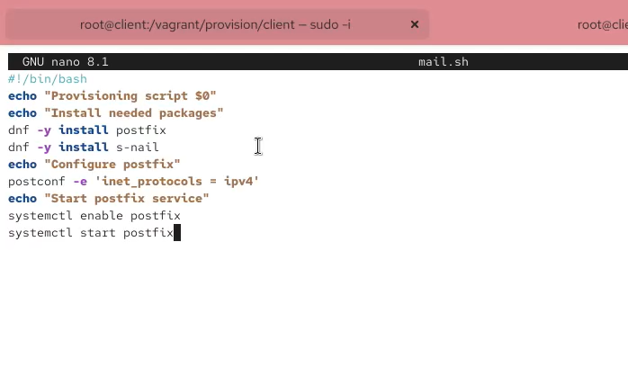{#fig-056 width=70%}

Для отработки созданного скрипта во время загрузки виртуальной машины server в конфигурационном файле Vagrantfile необходимо добавить в разделе конфигурации для сервера ([рис. @fig-057]):

```
server.vm.provision "server mail",
	type: "shell",
	preserve_order: true,
	path: "provision/server/mail.sh"
```

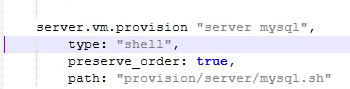{#fig-057 width=70%}

Для отработки созданного скрипта во время загрузки виртуальной машины client в конфигурационном файле Vagrantfile необходимо добавить в разделе конфигурации для клиента ([рис. @fig-058]):

```
client.vm.provision "client mail",
	type: "shell",
	preserve_order: true,
	path: "provision/client/mail.sh"
```

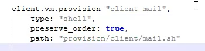{#fig-058 width=70%}

После этого можно выключать виртуальные машины server и client: ```make server-halt``` и ```make client-halt``` ([рис. @fig-059])


## Контрольные вопросы + ответы

1. В каком каталоге и в каком файле следует смотреть конфигурацию Postfix?

Конфигурация Postfix обычно хранится в файле main.cf, а путь к этому файлу может различаться в разных системах. Однако, обычно он находится в каталоге /etc/postfix/. Таким образом, путь к файлу конфигурации будет /etc/postfix/main.cf.

2. Каким образом можно проверить корректность синтаксиса в конфигурационном файле Postfix?

Для проверки корректности синтаксиса в конфигурационном файле Postfix можно использовать команду postfix check. Например: postfix check

3. В каких параметрах конфигурации Postfix требуется внести изменения в значениях для настройки возможности отправки писем не на локальный хост, а на доменные адреса?

Для настройки возможности отправки писем не на локальный хост, а на доменные адреса, вы можете изменить параметры myhostname и mydomain в файле main.cf. Пример: myhostname = yourhostname и mydomain = yourdomain.com. Также, убедитесь, что параметр mydestination не содержит локальных
доменных имен, если вы хотите отправлять письма только на доменные адреса.

4. Приведите примеры работы с утилитой mail по отправке письма, просмотру имеющихся писем, удалению письма.

Примеры работы с утилитой mail:

- Отправка письма: echo "Текст письма" | mail -s "Тема" user@example.com

- Просмотр имеющихся писем: mail

- Удаление письма: mail -d номер_письма


5. Приведите примеры работы с утилитой postqueue. Как посмотреть очередь сообщений? Как определить число сообщений в очереди? Как отправить все сообщения, находящиеся в очереди? Как удалить письмо из очереди?

Примеры работы с утилитой postqueue:

- Просмотр очереди сообщений: postqueue -p

- Определение числа сообщений в очереди: postqueue -p | grep -c "?"

- Отправка всех сообщений из очереди: postqueue -f

- Удаление письма из очереди (где ID_СООБЩЕНИЯ - идентификатор сообщения): postsuper -d ID_СООБЩЕНИЯ

# Выводы

В ходе выполнения лабораторной работы №8 мы приобрели практические навыки по установке и конфигурированию SMTP-сервера.

# Список литературы

1. [Лаборатораня работа №8](https://esystem.rudn.ru/pluginfile.php/2854762/mod_resource/content/8/008-smtp.pdf)
