---
# Preamble

## Author
author:
  name: Мантуров Татархан Бесланович
  degrees: DSc
  orcid: 0000-0002-0877-7063
  email: kulyabov-ds@rudn.ru
  affiliation:
    - name: Российский университет дружбы народов
      country: Российская Федерация
      postal-code: 117198
      city: Москва
      address: ул. Миклухо-Маклая, д. 6
## Title
title: "Отчёт по лабораторной работе №9"
subtitle: "Дисциплина: Администрирование сетевых подсистем"
license: "CC BY"
## Generic options
lang: ru-RU
number-sections: true
toc: true
toc-title: "Содержание"
toc-depth: 2
## Crossref customization
crossref:
  lof-title: "Список иллюстраций"
  lot-title: "Список таблиц"
  lol-title: "Листинги"
## Bibliography
bibliography:
  - bib/cite.bib
csl: _resources/csl/gost-r-7-0-5-2008-numeric.csl
## Formats
format:
### Pdf output format
  pdf:
    toc: true
    number-sections: true
    colorlinks: false
    toc-depth: 2
    lof: true # List of figures
    lot: true # List of tables
#### Document
    documentclass: scrreprt
    papersize: a4
    fontsize: 12pt
    linestretch: 1.5
#### Language
    babel-lang: russian
    babel-otherlangs: english
#### Biblatex
    cite-method: biblatex
    biblio-style: gost-numeric
    biblatexoptions:
      - backend=biber
      - langhook=extras
      - autolang=other*
#### Misc options
    csquotes: true
    indent: true
    header-includes: |
      \usepackage{indentfirst}
      \usepackage{float}
      \floatplacement{figure}{H}
      \usepackage[math,RM={Scale=0.94},SS={Scale=0.94},SScon={Scale=0.94},TT={Scale=MatchLowercase,FakeStretch=0.9},DefaultFeatures={Ligatures=Common}]{plex-otf}
### Docx output format
  docx:
    toc: true
    number-sections: true
    toc-depth: 2
---

# Цель работы

Целью данной работы является приобретение практических навыков по установке и простейшему конфигурированию POP3/IMAP-сервера.

# Задание

1. Установить на виртуальной машине server Dovecot и Telnet для дальнейшей проверки корректности работы почтового сервера
2. Настроить Dovecot
3. Установить на виртуальной машине client программу для чтения почты Evolution
и настроить её для манипуляций с почтой вашего пользователя. Проверить корректность работы почтового сервера как с виртуальной машины server, так и с виртуальной машины client
4. Изменить скрипт для Vagrant, фиксирующий действия по установке и настройке Postfix и Dovecote во внутреннем окружении виртуальной машины server, создать скрипт для Vagrant, фиксирующий действия по установке Evolution во внутреннем окружении виртуальной машины client. Соответствующим образом внести изменения в Vagrantfile

# Выполнение лабораторной работы

## Установка Dovecot

Загрузили нашу операционную систему и перешли в рабочий каталог с проектом: ```cd /var/tmp/tbmanturov/vagrant``` ([рис. @fig-001])

Запустили виртуальную машину server: ```make server-up``` ([рис. @fig-002]) 

Далее на виртуальной машине server вошли под созданным нами в предыдущей работе пользователем и открыли терминал. Перешли в режим суперпользователя: ```sudo -i``` ([рис. @fig-003])

Далее установили необходимые для работы пакеты: ```dnf -y install dovecot telnet``` ([рис. @fig-004])

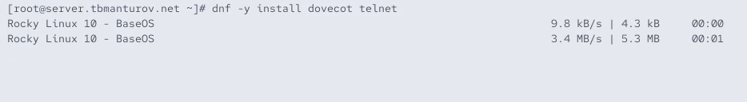{#fig-004 width=70%}

## Настройка dovecot

В конфигурационном файле */etc/dovecot/dovecot.conf* прописали список почтовых протоколов, по которым разрешено работать Dovecot: ```protocols = imap pop3``` ([рис. @fig-005])

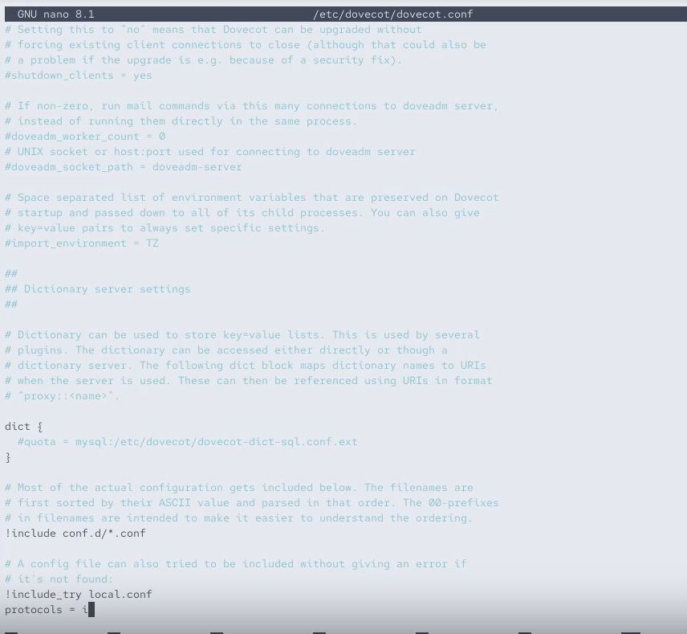{#fig-005 width=70%}

В конфигурационном файле */etc/dovecot/conf.d/10-auth.conf* проверили, что указан метод аутентификации plain: ```auth_mechanisms = plain``` ([рис. @fig-006])

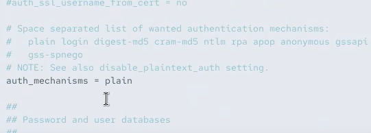{#fig-006 width=70%}

В конфигурационном файле */etc/dovecot/conf.d/auth-system.conf.ext* проверили, что для поиска пользователей и их паролей используется pam и файл passwd ([рис. @fig-007]), ([рис. @fig-008]):

```
passdb {
	driver = pam
}

userdb {
	driver = passwd
}
```

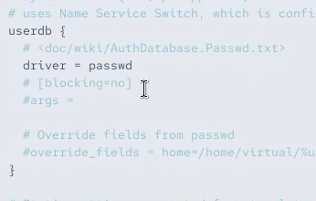{#fig-007 width=70%}

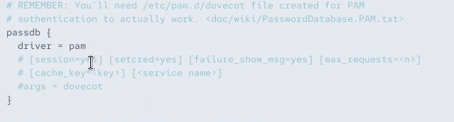{#fig-008 width=70%}

В конфигурационном файле */etc/dovecot/conf.d/10-mail.conf* настроили месторасположение почтовых ящиков пользователей: ```mail_location = maildir:~/Maildir``` ([рис. @fig-009])

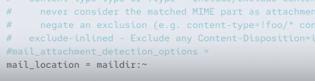{#fig-009 width=70%}

В Postfix задали каталог для доставки почты: ```postconf -e 'home_mailbox = Maildir/'``` ([рис. @fig-010])

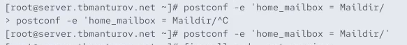{#fig-010 width=70%}

Далее сконфигурировали межсетевой экран, разрешив работать службам протоколов POP3 и IMAP ([рис. @fig-011]):

```firewall-cmd --get-services```

```firewall-cmd --add-service=pop3 --permanent```

```firewall-cmd --add-service=pop3s --permanent```

```firewall-cmd --add-service=imap --permanent```

```firewall-cmd --add-service=imaps --permanent```

```firewall-cmd --reload```

```firewall-cmd --list-services```

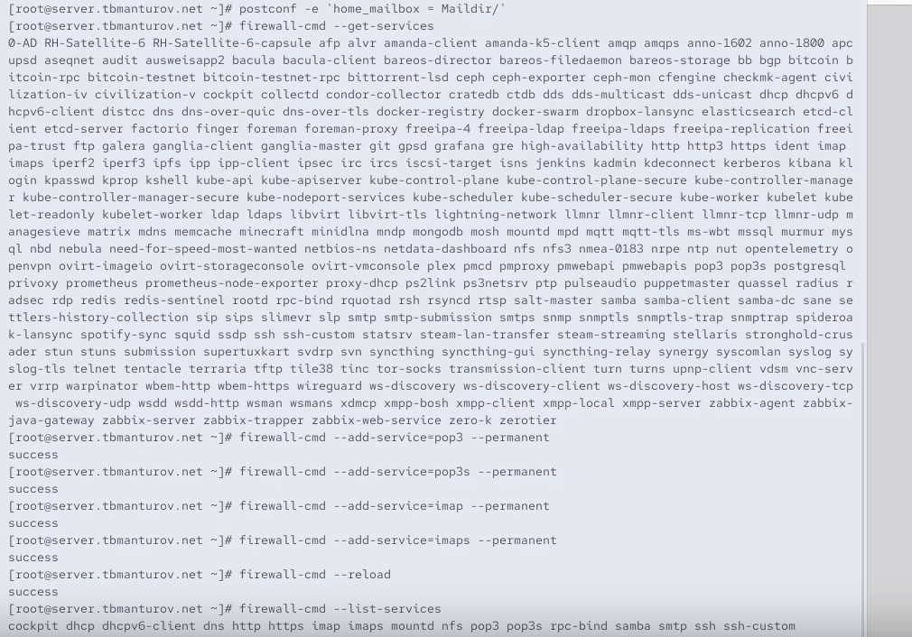{#fig-011 width=70%}

Восстановили контекст безопасности в SELinux: ```restorecon -vR /etc``` ([рис. @fig-012])

{#fig-012 width=70%}

Перезапустили Postfix и запустили Dovecot ([рис. @fig-013]):

```systemctl restart postfix```

```systemctl enable dovecot```

```systemctl start dovecot```

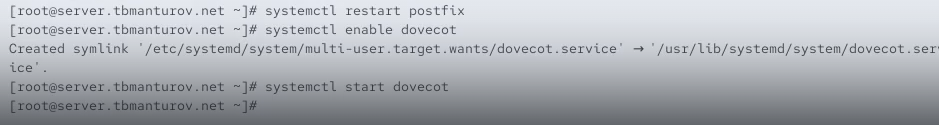{#fig-013 width=70%}

## Проверка работы Dovecot

На дополнительном терминале виртуальной машины server запустили мониторинг работы почтовой службы: ```tail -f /var/log/maillog``` ([рис. @fig-014])

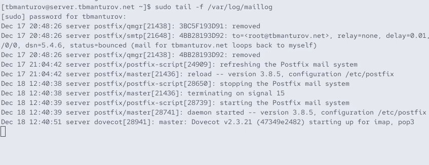{#fig-014 width=70%}

На терминале сервера для просмотра имеющейся почты использовали ```MAIL=~/Maildir mail``` ([рис. @fig-015])

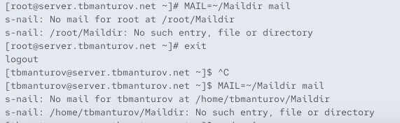{#fig-015 width=70%}

Для просмотра mailbox пользователя на сервере на терминале с правами суперпользователя использовали команду ```doveadm mailbox list -u tbmanturov``` ([рис. @fig-016])

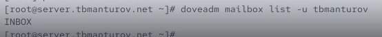{#fig-016 width=70%}

Далее загрузили виртуальную машину client, вошли под нашим пользователем и открыли терминал. Там перешли в режим суперпользователя ([рис. @fig-017]), ([рис. @fig-018])

Установили почтовый клиент: ```dnf -y install evolution``` ([рис. @fig-019])

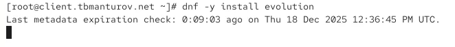{#fig-019 width=70%}

Запустили и настройте почтовый клиент Evolution ([рис. @fig-020]), ([рис. @fig-021]), ([рис. @fig-022]), ([рис. @fig-023])):

- в окне настройки учётной записи почты указали имя, адрес почты в виде tbmanturov@tbmanturov.net

- в качестве IMAP-сервера для входящих сообщений и SMTP-сервера для исходящих сообщений прописали mail.tbmanturov.net, в качестве пользователя для входящих и исходящих сообщений указали tbmanturov

- проверили номера портов: для IMAP — порт 143, для SMTP — порт 25

- проверили настройки SSL и метода аутентификации: для IMAP — STARTTLS, аутентификация по обычному паролю, для SMTP — без аутентификации, аутентификация — «Без аутентификации»

- при возникновении сообщения о небезопасном соединении выставили галочку о понимании риска работы по такому соединению и нажмали «Ок», затем подтвердили исключение безопасности, нажав в появившемся окне соответствующую кнопку

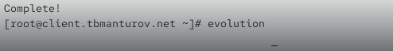{#fig-020 width=70%}

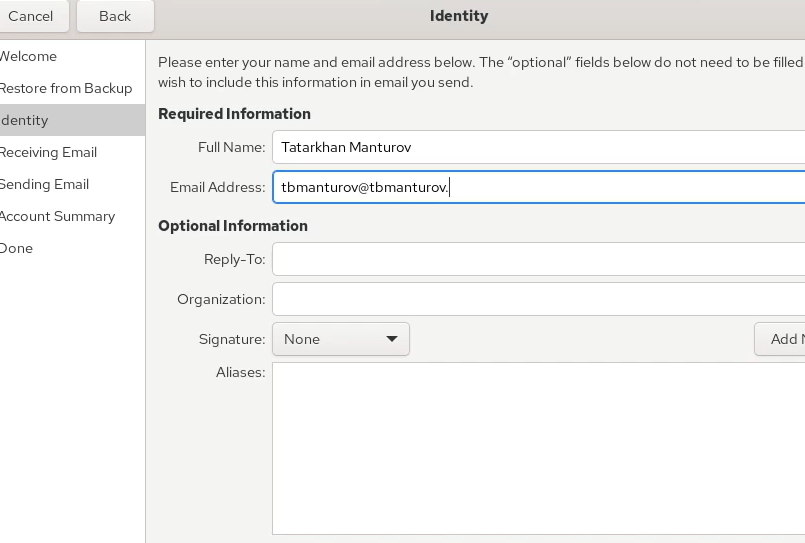{#fig-021 width=70%}

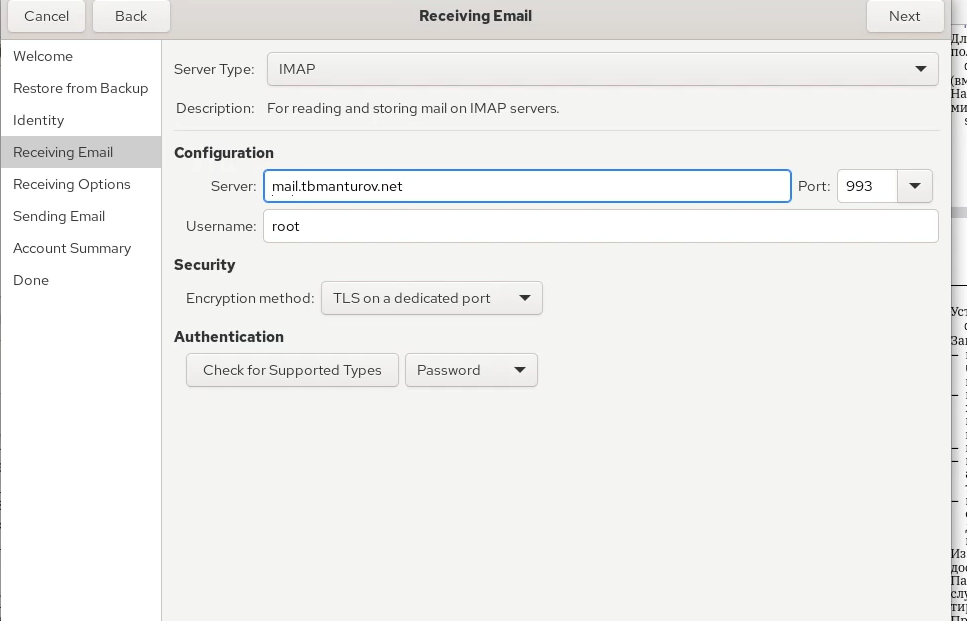{#fig-022 width=70%}

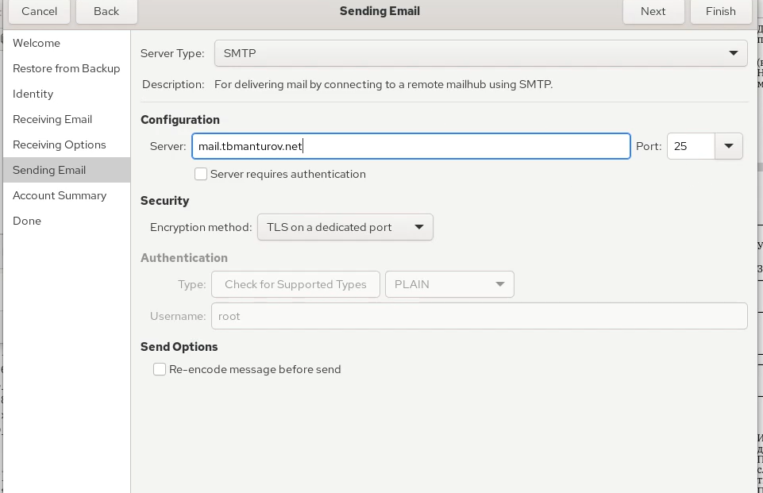{#fig-023 width=70%}


Из почтового клиента отправили себе несколько тестовых писем, убедились, что они доставлены ([рис. @fig-027]), ([рис. @fig-028]), ([рис. @fig-030]), ([рис. @fig-031])

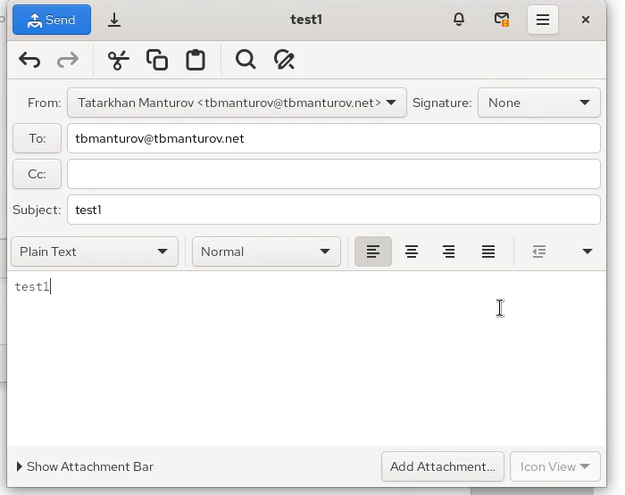{#fig-027 width=70%}

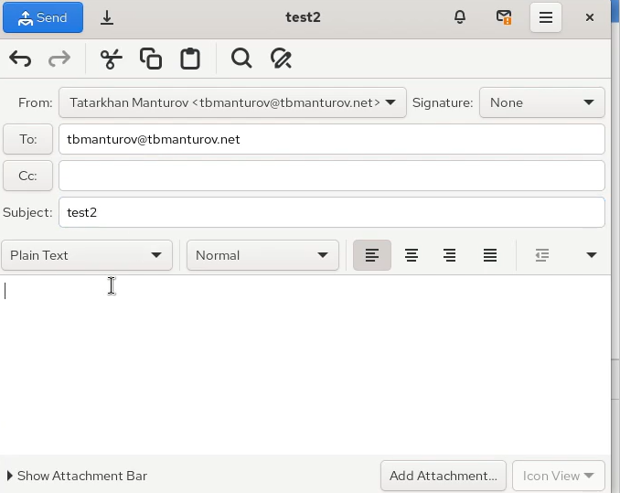{#fig-028 width=70%}

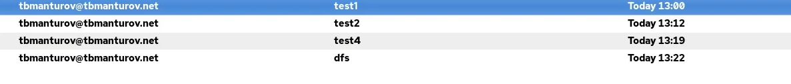{#fig-031 width=70%}


Параллельно посмотрели, какие сообщения выдаются при мониторинге почтовой службы на сервере, а также при использовании doveadm и mail ([рис. @fig-034])
**Логи Postfix (/var/log/maillog):**

- Видна успешная доставка писем от пользователя tbmanturov@tbmanturov.net самому себе

- Статусы: status=sent (delivered to maildir) — письма помещены в Maildir-каталог пользователя

- Соединения идут с client.tbmanturov.net (192.168.1.30), что говорит о том, что почта отправляется через клиентскую машину

**Просмотр почты через mail:**

- Пользователь tbmanturov видит 3 письма в своём почтовом ящике: test1, test2, test3 (все от самого себя)

**Проверка почтовых ящиков через doveadm:**

- Показывает только один ящик — INBOX

- Письма хранятся во входящих, без дополнительных папок

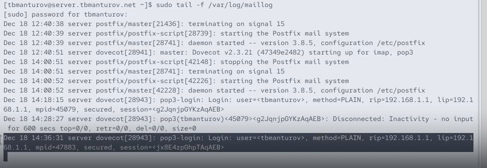{#fig-034 width=70%}

Далее проверили работу почтовой службы, используя на сервере протокол Telnet. Подключились с помощью протокола Telnet к почтовому серверу по протоколу POP3 (через порт 110), ввели свой логин для подключения и пароль ([рис. @fig-037]):

```telnet mail.tbmanturov.net 110```

```user tbmanturov```

```pass Zz28466300) ```

{#fig-037 width=70%}


## Внесение изменений в настройки внутреннего окружения виртуальной машины

На виртуальной машине server перешлм в каталог для внесения изменений в настройки внутреннего окружения */vagrant/provision/server/* и соответствующие подкаталоги поместили конфигурационные файлы Dovecot: ([рис. @fig-039]):

```cd /vagrant/provision/server```

```mkdir -p /vagrant/provision/server/mail/etc/dovecot/conf.d```

```cp -R /etc/dovecot/dovecot.conf /vagrant/provision/server/mail/etc/dovecot/```

```cp -R /etc/dovecot/conf.d/10-auth.conf /vagrant/provision/server/mail/etc/dovecot/conf.d/```

```cp -R /etc/dovecot/conf.d/auth-system.conf.ext /vagrant/provision/server/mail/etc/dovecot/conf.d/```

```cp -R /etc/dovecot/conf.d/10-mail.conf /vagrant/provision/server/mail/etc/dovecot/conf.d/```

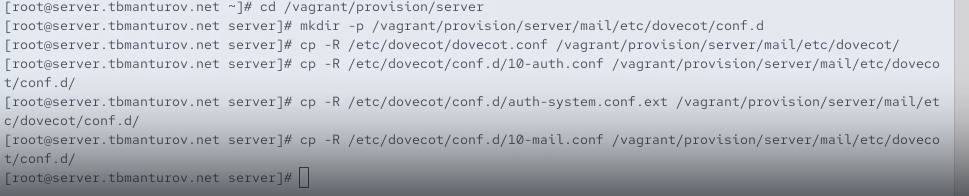{#fig-039 width=70%}

Далее внесли изменения в файл */vagrant/provision/server/mail.sh*, добавив в него строки по устанвке Dovecot и Telnet, по настройке межсетевого экрана,по настройке Postfix в части задания месторасположения почтового ящика, по перезапуску Postfix и запуску Dovecot ([рис. @fig-040]):

```
#!/bin/bash
echo "Provisioning script $0"
echo "Install needed packages"
dnf -y install postfix
dnf -y install s-nail
dnf -y install dovecot
dnf -y install telnet
echo "Copy configuration files"
#cp -R /vagrant/provision/server/mail/etc/* /etc
echo "Configure firewall"
firewall-cmd --add-service=smtp --permanent
firewall-cmd --reload
firewall-cmd --get-services
firewall-cmd --add-service=pop3 --permanent
firewall-cmd --add-service=pop3s --permanent
firewall-cmd --add-service=imap --permanent
firewall-cmd --add-service=imaps --permanent
firewall-cmd --reload
firewall-cmd --list-services
restorecon -vR /etc
echo "Start postfix service"
systemctl enable postfix
systemctl start postfix
echo "Configure postfix"
postconf -e 'mydomain = user.net'
postconf -e 'myorigin = $mydomain'
postconf -e 'inet_protocols = ipv4'
postconf -e 'inet_interfaces = all'
postconf -e 'mydestination = $myhostname, localhost.$mydomain, localhost, $mydomain'
postconf -e 'mynetworks = 127.0.0.0/8, 192.168.0.0/16'
postconf -e 'home_mailbox = Maildir/'
postfix set-permissions
restorecon -vR /etc
systemctl stop postfix
systemctl start postfix
systemctl enable dovecot
systemctl start dovecot
```

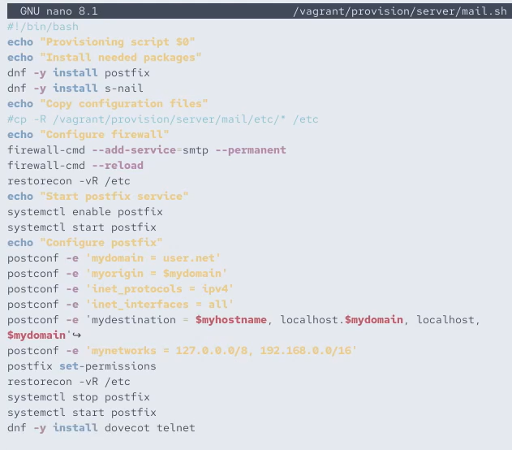{#fig-040 width=70%}

На виртуальной машине client в каталоге */vagrant/provision/client* скорректировали файл *mail.sh*, прописав в нём ```dnf -y install evolution``` ([рис. @fig-041]): 

```
#!/bin/bash
echo "Provisioning script $0"
echo "Install needed packages"
dnf -y install postfix
dnf -y install s-nail
dnf -y install evolution
echo "Configure postfix"
postconf -e 'inet_protocols = ipv4'
echo "Start postfix service"
systemctl enable postfix
systemctl start postfix
```

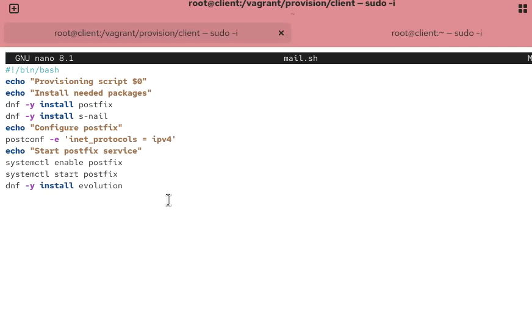{#fig-041 width=70%}

После этого можно выключать виртуальные машины server и client: ```make server-halt``` и ```make client-halt``` ([рис. @fig-042])

## Контрольные вопросы + ответы

1. За что отвечает протокол SMTP?

Отвечает за отправку электронной почты. Этот протокол используется для передачи писем от отправителя к почтовому серверу и от сервера к серверу.

2. За что отвечает протокол IMAP?

Отвечает за доступ и управление электронной почтой на сервере. Позволяет клиентским приложениям просматривать, синхронизировать и управлять сообщениями, хранящимися на почтовом сервере.

3. За что отвечает протокол POP3?

Отвечает за получение электронной почты. Письма загружаются с почтового сервера на клиентский компьютер, и после этого они обычно удаляются с сервера (но это можно настроить).

4. В чём назначение Dovecot?

Это почтовый сервер, который предоставляет поддержку протоколов IMAP и POP3. Dovecot обеспечивает доступ к электронной почте на сервере, а также хранение и управление сообщениями.

5. В каких файлах обычно находятся настройки работы Dovecot? За что отвечает каждый из файлов?

/etc/dovecot/dovecot.conf: Основной файл конфигурации Dovecot.

/etc/dovecot/conf.d/: Дополнительные файлы конфигурации, разделенные на отдельные модули.

6. В чём назначение Postfix?

Это почтовый сервер (MTA - Mail Transfer Agent), отвечающий за отправку и маршрутизацию электронной почты.

7. Какие методы аутентификации пользователей можно использовать в Dovecot и в чём их отличие?

PLAIN: Передача учетных данных в открытом виде (не рекомендуется, если соединение не защищено).

LOGIN: Аутентификация по протоколу LOGIN, который шифрует только пароль.

8. Приведите пример заголовка письма с пояснениями его полей.

```
From: john.doe@example.com
To: jane.smith@example.com
Subject: Meeting Tomorrow
Date: Tue, 6 Dec 2023 14:30:00 +0000
```

9. Приведите примеры использования команд для работы с почтовыми протоколами через терминал (например через telnet).

Использование Telnet для проверки SMTP:

```
telnet example.com 25
EHLO example.com
MAIL FROM: sender@example.com
RCPT TO: recipient@example.com
DATA
Subject: Test Email
This is a test email.
.
QUIT
```

Использование Telnet для проверки POP3:

```
telnet example.com 110
USER your_username
PASS your_password
LIST
RETR 1
QUIT
```

10. Приведите примеры с пояснениями по работе с doveadm.

Получение информации о пользователях: doveadm user user@example.com

Получение списка всех писем пользователя: doveadm search mailbox INBOX ALL

Удаление письма: doveadm expunge -u user@example.com mailbox INBOX uid <UID>

# Выводы

В ходе выполнения лабораторной работы №9 мы приобрели практические навыки по установке и простейшему конфигурированию POP3/IMAP-сервера.

# Список литературы

1. [Лаборатораня работа №9](https://esystem.rudn.ru/pluginfile.php/2854766/mod_resource/content/6/009-imap.pdf)
