---
# Preamble

## Author
author:
  name: Мантуров Татархан Бесланович
  degrees: DSc
  orcid: 0000-0002-0877-7063
  email: kulyabov-ds@rudn.ru
  affiliation:
    - name: Российский университет дружбы народов
      country: Российская Федерация
      postal-code: 117198
      city: Москва
      address: ул. Миклухо-Маклая, д. 6
## Title
title: "Отчёт по лабораторной работе №11"
subtitle: "Дисциплина: Администрирование сетевых подсистем"
license: "CC BY"
## Generic options
lang: ru-RU
number-sections: true
toc: true
toc-title: "Содержание"
toc-depth: 2
## Crossref customization
crossref:
  lof-title: "Список иллюстраций"
  lot-title: "Список таблиц"
  lol-title: "Листинги"
## Bibliography
bibliography:
  - bib/cite.bib
csl: _resources/csl/gost-r-7-0-5-2008-numeric.csl
## Formats
format:
### Pdf output format
  pdf:
    toc: true
    number-sections: true
    colorlinks: false
    toc-depth: 2
    lof: true # List of figures
    lot: true # List of tables
#### Document
    documentclass: scrreprt
    papersize: a4
    fontsize: 12pt
    linestretch: 1.5
#### Language
    babel-lang: russian
    babel-otherlangs: english
#### Biblatex
    cite-method: biblatex
    biblio-style: gost-numeric
    biblatexoptions:
      - backend=biber
      - langhook=extras
      - autolang=other*
#### Misc options
    csquotes: true
    indent: true
    header-includes: |
      \usepackage{indentfirst}
      \usepackage{float}
      \floatplacement{figure}{H}
      \usepackage[math,RM={Scale=0.94},SS={Scale=0.94},SScon={Scale=0.94},TT={Scale=MatchLowercase,FakeStretch=0.9},DefaultFeatures={Ligatures=Common}]{plex-otf}
### Docx output format
  docx:
    toc: true
    number-sections: true
    toc-depth: 2
---

# Цель работы

Целью данной работы является приобретение практических навыков по настройке удалённого доступа к серверу с помощью SSH.

# Задание

1. Настроить запрет удалённого доступа на сервер по SSH для пользователя root
2. Настроить разрешение удалённого доступа к серверу по SSH только для пользователей группы vagrant и вашего пользователя
3. Настроить удалённый доступ к серверу по SSH через порт 2022
4. Настроить удалённый доступ к серверу по SSH по ключу
5. Организовать SSH-туннель с клиента на сервер, перенаправив локальное соединение с TCP-порта 80 на порт 8080 
6. Используя удалённое SSH-соединение, выполнить с клиента несколько команд на сервере
7. Используя удалённое SSH-соединение, запустить с клиента графическое приложение на сервере
8. Написать скрипт для Vagrant, фиксирующий действия по настройке SSH-сервера во внутреннем окружении виртуальной машины server. Соответствующим образом внести изменения в Vagrantfile

# Выполнение лабораторной работы

## Запрет удалённого доступа по SSH для пользователя root

Загрузили нашу операционную систему и перешли в рабочий каталог с проектом: ```cd /var/tmp/tbmanturov/vagrant``` ([рис. @fig-001])

Запустили виртуальную машину server: ```make server-up``` ([рис. @fig-002]) 

На сервере задали пароль для пользователя root: ```sudo -i``` и ```passwd root``` ([рис. @fig-003])

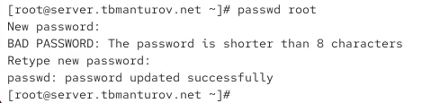{#fig-003 width=70%}

На сервере в дополнительном терминале запустите мониторинг системных событий: ```sudo -i``` и ```journalctl -x -f``` ([рис. @fig-004])

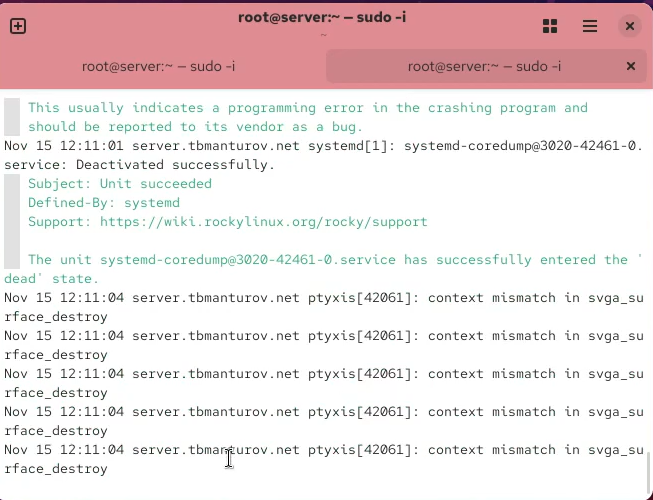{#fig-004 width=70%}

Далее запустили виртуальную машину client ([рис. @fig-005])

С клиента попытались получить доступ к серверу посредством SSH-соединения через пользователя root: ```ssh root@server.tbmanturov.net``` ([рис. @fig-006])

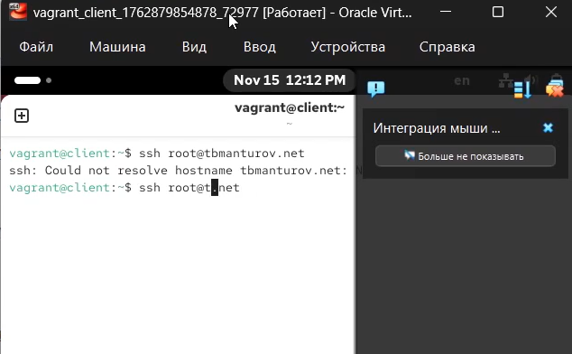{#fig-006 width=70%}

Несмотря на правильно введенный пароль для пользователя root, не получилось подключиться, так как в конфигурации ssh запрещено подключение для пользователя root с помощью пароля (по умолючанию используется настройка PermitRootLogin prohibit-password)

На сервере октрыли файл */etc/ssh/sshd_config* конфигурации sshd для редактирования и запретили вход на сервер пользователю root, установив: ```PermitRootLogin no``` ([рис. @fig-007])

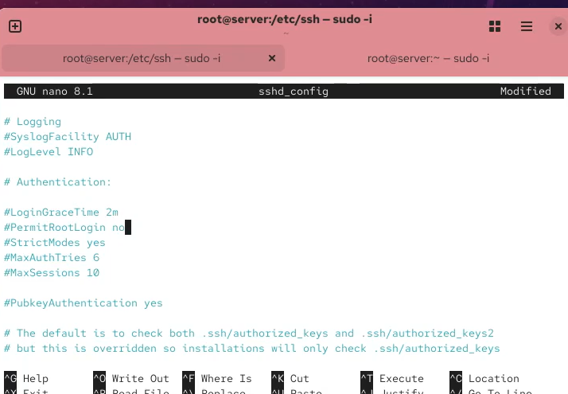{#fig-007 width=70%}

После сохранения изменений в файле конфигурации перезапустили sshd: ```systemctl restart sshd``` ([рис. @fig-008])

Повторили попытку получения доступа с клиента к серверу посредством SSH-соединения через пользователя root: ```ssh root@server``` ([рис. @fig-009])

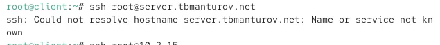{#fig-009 width=70%}

Теперь также запрещен доступ root пользователю на сервер любыми средствами аутентификации

## Ограничение списка пользователей для удалённого доступа по SSH

С клиента попытались получить доступ к серверу посредством SSH-соединения через пользователя tbmanturov: ```ssh tbmanturov@tbmanturov.user.net```. Всё проходит успешно ([рис. @fig-009])

{#fig-010 width=70%}

На сервере открыли файл */etc/ssh/sshd_config* конфигурации sshd на редактирование и добавили строку ```AllowUsers vagrant``` ([рис. @fig-011])

{#fig-011 width=70%}

После сохранения изменений в файле конфигурации перезапустили sshd: ```systemctl restart sshd``` ([рис. @fig-012])

Повторили попытку получения доступа с клиента к серверу посредством SSH-соединения через пользователя tbmanturov: ```ssh tbmanturov@server.tbmanturov.net``` ([рис. @fig-013])

SSH сервер теперь разрешает подключение только пользователю vagrant, а все остальные пользователи (включая tbmanturov) блокируются. Директива ```AllowUsers``` задает "белый список" пользователей, которым разрешено подключаться по SSH

## Настройка дополнительных портов для удалённого доступа по SSH

На сервере в файле конфигурации sshd */etc/ssh/sshd_config* нашли строку Port и ниже этой строки добавили ([рис. @fig-017]):

```
Port 22
Port 2022
```

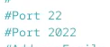{#fig-017 width=70%}

Эта запись сообщает процессу sshd о необходимости организации соединения через два разных порта, что даёт гарантию возможности открыть сеансы SSH, даже если была сделана ошибка в конфигурации

Далее после сохранения изменений в файле конфигурации перезапустили sshd: ```systemctl restart sshd``` ([рис. @fig-018])

Посмотрели расширенный статус работы sshd: ```systemctl status -l sshd```. Система сообщила нам об отказе в работе sshd через порт 2022 ([рис. @fig-019])

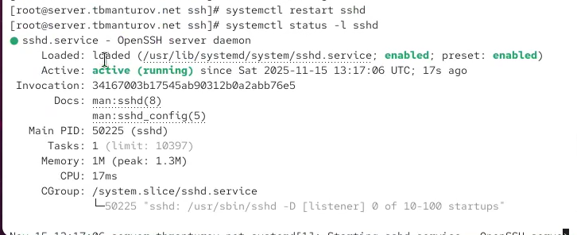{#fig-019 width=70%}

Далее исправили на сервере метки SELinux к порту 2022: ```semanage port -a -t ssh_port_t -p tcp 2022``` ([рис. @fig-020])

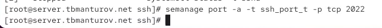{#fig-020 width=70%}

В настройках межсетевого экрана открыли порт 2022 протокола TCP ([рис. @fig-021]):

```firewall-cmd --add-port=2022/tcp```

```firewall-cmd --add-port=2022/tcp --permanent```

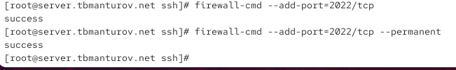{#fig-021 width=70%}

Вновь перезапустили sshd и посмотрели расширенный статус его работы. Статус показывает, что процесс sshd теперь прослушивает два порта ([рис. @fig-023])

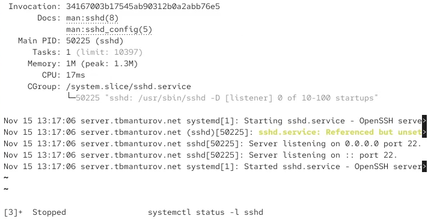{#fig-023 width=70%}

С клиента попытались получить доступ к серверу посредством SSH-соединения через пользователя tbmanturov: ```ssh tbmanturov@server.tbmanturov.net```. После открытия оболочки пользователя ввели ```sudo -i``` для получения доступа root. Отлогинились от root и нашего пользователя на сервере, введя дважды ```logout``` ([рис. @fig-024])

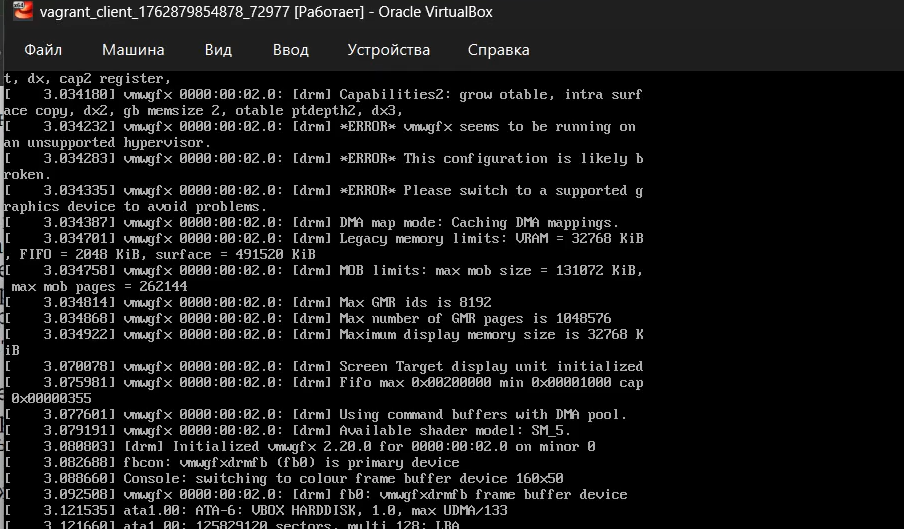{#fig-024 width=70%}

Повторили попытку получения доступа с клиента к серверу посредством SSH-соединения через пользователя tbmanturov, указав порт 2022: ```ssh -p2022 tbmanturov@server.tbmanturov.net```. После открытия оболочки пользователя ввели ```sudo -i``` для получения доступа root. Отлогинились от root и нашего пользователя на сервере, введя дважды ```logout```


## Настройка удалённого доступа по SSH по ключу

На сервере в конфигурационном файле */etc/ssh/sshd_config* задали параметр, разрешающий аутентификацию по ключу: ```PubkeyAuthentication yes``` ([рис. @fig-026])

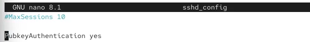{#fig-026 width=70%}
 
После сохранения изменений в файле конфигурации перезапустили sshd

На клиенте сформировали SSH-ключ, введя в терминале под пользователем tbmanturov: ```ssh-keygen -t rsa -b 4096 ```. Закрытый ключ теперь будет записан в файл *~/.ssh/id_rsa*, а открытый ключ записывается в файл *~/.ssh/id_rsa.pub* ([рис. @fig-028])

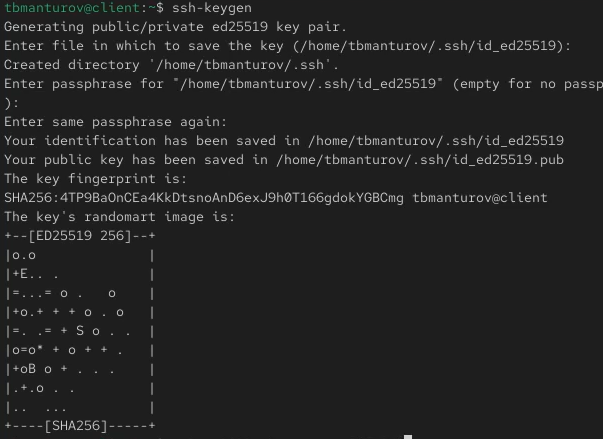{#fig-028 width=70%}

Скопировали открытый ключ на сервер, введя на клиенте: ```ssh-copy-id tbmanturov@server.tbmanturov.net```. При запросе ввели пароль пользователя на удалённом сервере ([рис. @fig-029])

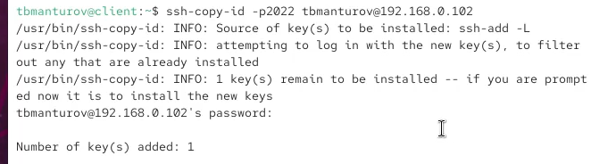{#fig-029 width=70%}

Попробовали получить доступ с клиента к серверу посредством SSH-соединения: ```ssh tbmanturov@server.tbmanturov.net```. Теперь мы проходим аутентификацию без ввода пароля для учётной записи удалённого пользователя. Отлогинились с сервера, используя комбинацию клавиш *Ctrl + d* ([рис. @fig-030])

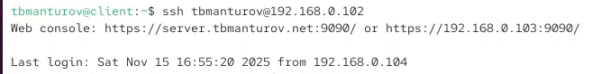{#fig-030 width=70%}

## Организация туннелей SSH, перенаправление TCP-портов

На клиенте посмотрели, запущены ли какие-то службы с протоколом TCP: ```lsof | grep TCP``` ([рис. @fig-031])

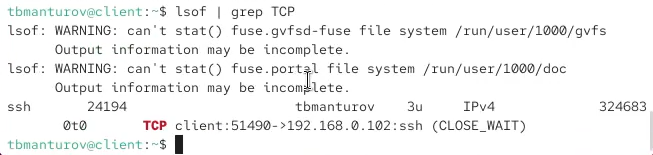{#fig-031 width=70%}

Далее перенаправили порт 80 на server.tbmanturov.net на порт 8080 на локальной машине: ```ssh -fNL 8080:localhost:80 tbmanturov@server.tbmanturov.net``` ([рис. @fig-032])

{#fig-032 width=70%}

Вновь на клиенте посмотрели, запущены ли какие-то службы с протоколом TCP: ```lsof | grep TCP``` ([рис. @fig-033])

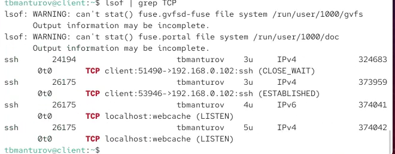{#fig-033 width=70%}

**Комментарии к выводу:**

1. SSH порт форвардинг работает - видно TCP соединение между клиентом и сервером:

- client.tbmanturov.net:47494->ns.tbmanturov.net:ssh

2. Созданы локальные прослушивающие сокеты на порту 8080:

- TCP localhost:webcache (LISTEN) - это порт 8080 (webcache)

- Оба для IPv4 и IPv6

3. SSH туннель активен - соединение в состоянии ESTABLISHED

4. Порт 80 сервера перенаправлен на локальный порт 8080 клиента

Команда ssh -fNL 8080:localhost:80 успешно создала SSH туннель, который перенаправляет локальный порт 8080 на порт 80 удаленного сервера через зашифрованное соединение.

На клиенте запустили браузер и в адресной строке ввели localhost:8080. Убедились, что отобразилась страница с приветствием «Welcome to the server.tbmanturov.net server» ([рис. @fig-034])

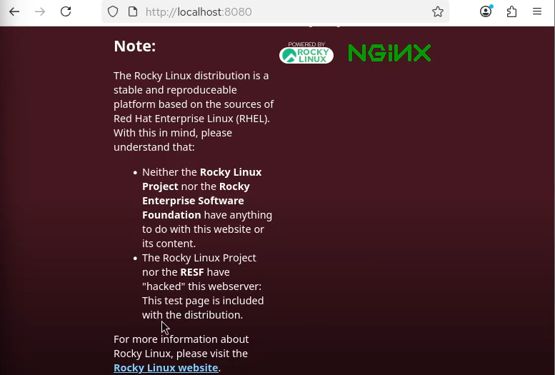{#fig-034 width=70%}

## Запуск консольных приложений через SSH

На клиенте открыли терминал под пользователем tbmanturov и посмотрели с клиента имя узла сервера: ```ssh tbmanturov@server.tbmanturov.net hostname``` ([рис. @fig-035])

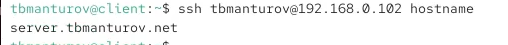{#fig-035 width=70%}

Посмотрели с клиента список файлов на сервере: ```ssh tbmanturov@server.tbmanturov.net ls -Al``` ([рис. @fig-036])

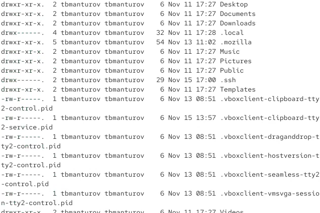{#fig-036 width=70%}

Посмотрели с клиента почту на сервере: ```ssh tbmanturov@server.tbmanturov.net MAIL=~/Maildir/ mail``` ([рис. @fig-037])

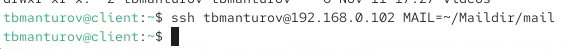{#fig-037 width=70%}

## Запуск графических приложений через SSH (X11Forwarding)

На сервере в конфигурационном файле */etc/ssh/sshd_config* разрешили отображать на локальном клиентском компьютере графические интерфейсы X11: ```X11Forwarding yes``` ([рис. @fig-038])

{#fig-038 width=70%}

После сохранения изменения в конфигурационном файле перезапустили sshd

Далее попробовали с клиента удалённо подключиться к серверу и запустить графическое приложение, например firefox: ```ssh -YC tbmanturov@server.tbmanturov.net firefox``` ([рис. @fig-040])

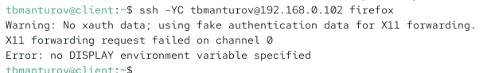{#fig-040 width=70%} 

## Внесение изменений в настройки внутреннего окружения виртуальной машины

На виртуальной машине server перешли в каталог для внесения изменений в настройки внутреннего окружения */vagrant/provision/server/*, создали в нём каталог ssh, в который поместили в соответствующие подкаталоги поместили конфигурационный файл sshd_config ([рис. @fig-041]):

```cd /vagrant/provision/server```

```mkdir -p /vagrant/provision/server/ssh/etc/ssh```

```cp -R /etc/ssh/sshd_config /vagrant/provision/server/ssh/etc/ssh/```

{#fig-041 width=70%}

В каталоге /vagrant/provision/server создали исполняемый файл ssh.sh:
Открыв его на редактирование, прописали в нём следующий скрипт ([рис. @fig-043]):

```
#!/bin/bash
echo "Provisioning script $0"
echo "Copy configuration files"
cp -R /vagrant/provision/server/ssh/etc/* /etc
restorecon -vR /etc
echo "Configure firewall"
firewall-cmd --add-port=2022/tcp
firewall-cmd --add-port=2022/tcp --permanent
echo "Tuning SELinux"
semanage port -a -t ssh_port_t -p tcp 2022
echo "Restart sshd service"
systemctl restart sshd
```

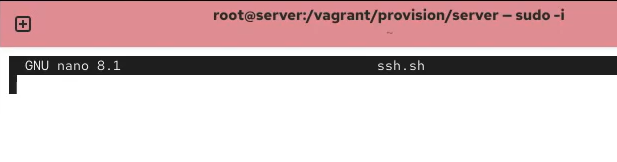{#fig-043 width=70%}

Для отработки созданного скрипта во время загрузки виртуальной машины server в конфигурационный файл Vagrantfile добавили в разделе конфигурации для сервера ([рис. @fig-044]):

```
server.vm.provision "server ssh",
	type: "shell",
	preserve_order: true,
	path: "provision/server/ssh.sh"
```

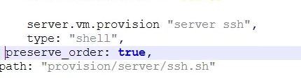{#fig-044 width=70%}

После этого можно выключать виртуальные машины server и client: ```make server-halt``` и ```make client-halt```
## Контрольные вопросы + ответы

1. Вы хотите запретить удалённый доступ по SSH на сервер пользователю root и разрешить доступ пользователю alice. Как это сделать?

В конфигурационном файле SSH /etc/ssh/sshd_config:

```
# Запрет удалённого доступа пользователю root
PermitRootLogin no

# Разрешение доступа пользователю alice
AllowUsers alice
```

После внесения изменений, необходимо перезапустить службу SSH: sudo service ssh restart

2. Как настроить удалённый доступ по SSH через несколько портов? Для чего это может потребоваться?

В конфигурационном файле /etc/ssh/sshd_config добавьте строки:

```
# Первый порт (по умолчанию 22)
Port 22
# Второй порт
Port 2022
```

После изменений перезапустите службу SSH. Это может быть полезно для повышения безопасности, а также для избежания конфликтов с другими службами, использующими порт 22.

3. Какие параметры используются для создания туннеля SSH, когда команда ssh устанавливает фоновое соединение и не ожидает какой-либо конкретной команды?

ssh -N -f -L local_port:destination_host:remote_port user@ssh_server
-N: Не выполнять команду на удаленном хосте.
-f: Перевести ssh в фоновый режим после установки туннеля.

4. Как настроить локальную переадресацию с локального порта 5555 на порт 80 сервера server2.example.com?

ssh -L 5555:server2.example.com:80 user@ssh_server

Теперь, при подключении к локальному порту 5555, трафик будет перенаправляться через SSH к порту 80 на сервере server2.example.com.

5. Как настроить SELinux, чтобы позволить SSH связываться с портом 2022?

sudo semanage port -a -t ssh_port_t -p tcp 2022

Данная команда добавляет правило SELinux, разрешая использование порта 2022 для сервиса ssh.

6. Как настроить межсетевой экран на сервере, чтобы разрешить входящие подключения по SSH через порт 2022?

sudo firewall-cmd --permanent --add-port=2022/tcp

sudo firewall-cmd --reload

Эти команды добавляют правило в межсетевой экран для разрешения входящих подключений по SSH через порт 2022 и перезагружают конфигурацию межсетевого экрана.

# Выводы

В ходе выполнения лабораторной работы №11 мы приобрели практические навыки по настройке удалённого доступа к серверу с помощью SSH.

# Список литературы

1. [Лаборатораня работа №11](https://esystem.rudn.ru/pluginfile.php/2854774/mod_resource/content/6/011-ssh.pdf)
