---
# Preamble

## Author
author:
  name: Мантуров Татархан Бесланович
  degrees: DSc
  email: 11322361366@pfur.ru
  affiliation:
    - name: Российский университет дружбы народов
      country: Российская Федерация
      postal-code: 117198
      city: Москва
      address: ул. Миклухо-Маклая, д. 6

## Title
title: Презентация по лабораторной работе №15
subtitle: Администрирование сетевых подсистем
license: CC BY
date: 2025-12-02

## Generic options
lang: ru-RU
crossref:
  lof-title: Список иллюстраций
  lot-title: Список таблиц
  lol-title: Листинги

## Fonts 
mainfont: PT Serif 
romanfont: PT Serif 
sansfont: PT Sans 
monofont: PT Mono 
mainfontoptions: Ligatures=TeX 
romanfontoptions: Ligatures=TeX 
sansfontoptions: Ligatures=TeX,Scale=MatchLowercase 
monofontoptions: Scale=MatchLowercase,Scale=0.9

## Formats
format:
### Pdf output format
  beamer:
    toc: true
    toc-title: Содержание
    number-sections: true
    colorlinks: false
    toc-depth: 2
    slide_level: 2
    aspectratio: 169
    section-titles: true
    theme: metropolis
    themeoptions: progressbar=frametitle,sectionpage=progressbar,numbering=fraction
    pdf-engine: xelatex
    fontenc: T2A
#### Language
    babel-lang: russian
    babel-otherlangs: english

### Html output
  revealjs:
    transition: slide
    margin: 0.2
    smaller: false
    output-ext: html
    theme: beige
    logo: _resources/image/logo_rudn.png
---

# Вводная часть

## Цель работы

Целью данной работы получить навыки по работе с журналами системных событий.

## Задание

1. Настроить сервер сетевого журналирования событий
2. Настроить клиент для передачи системных сообщений в сетевой журнал на сервере
3. Просмотреть журналы системных событий с помощью нескольких программ. При наличии сообщений о некорректной работе сервисов исправить ошибки в настройках соответствующих служб
4. Написать скрипты для Vagrant, фиксирующие действия по установке и настройке сетевого сервера журналирования

# Выполнение лабораторной работы

## Настройка сервера сетевого журнала

Загрузили нашу операционную систему и перешли в рабочий каталог с проектом: ```cd /var/tmp/tbmanturov/vagrant```

## Настройка сервера сетевого журнала

Запустили виртуальную машину server: ```make server-up``` 

## Настройка сервера сетевого журнала

Далее на виртуальной машине server вошли под созданным нами пользователем и открыли терминал. Перешли в режим суперпользователя: ```sudo -i```

## Настройка сервера сетевого журнала

На сервере создали файл конфигурации сетевого хранения журналов ([рис. @fig-004]):

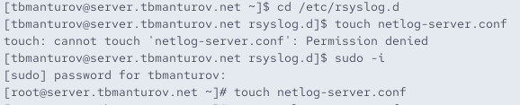{#fig-004 width=70%}

## Настройка сервера сетевого журнала

В файле конфигурации */etc/rsyslog.d/netlog-server.conf* включили приём записей журнала по TCP-порту 514 ([рис. @fig-005]):

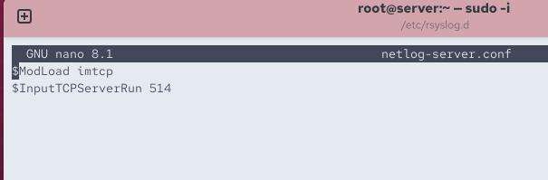{#fig-005 width=70%}

## Настройка сервера сетевого журнала

Перезапустили службу rsyslog на сервере: ```systemctl restart rsyslog``` ([рис. @fig-006])

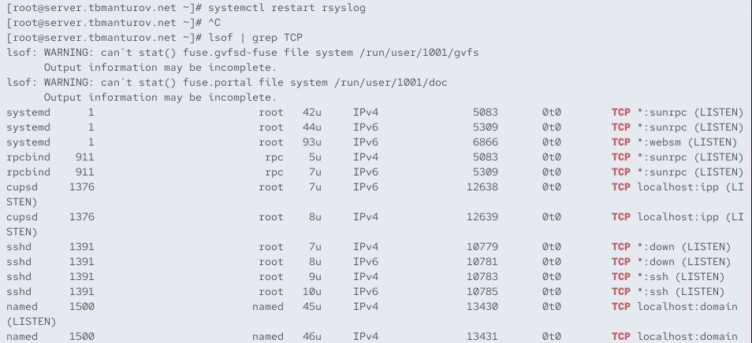{#fig-006 width=70%}

## Настройка сервера сетевого журнала

Посмотрели, какие порты, связанные с rsyslog, прослушиваются: ```lsof | grep TCP``` ([рис. @fig-007])

{#fig-007 width=70%}

## Настройка сервера сетевого журнала

На сервере настройте межсетевой экран для приёма сообщений по TCP-порту 514 ([рис. @fig-008]):

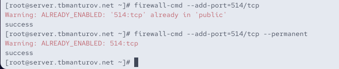{#fig-008 width=70%}

## Настройка клиента сетевого журнала

Запустили виртуальную машину client: ```make client-up``` ([рис. @fig-009]) 

## Настройка клиента сетевого журнала

Далее на виртуальной машине client вошли под созданным нами пользователем и открыли терминал. Перешли в режим суперпользователя: ```sudo -i``` ([рис. @fig-010])

## Настройка клиента сетевого журнала

На клиенте создали файл конфигурации сетевого хранения журналов ([рис. @fig-011]):

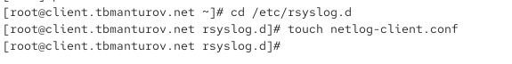{#fig-011 width=70%}

## Настройка клиента сетевого журнала

На клиенте в файле конфигурации */etc/rsyslog.d/netlog-client.conf* включили
перенаправление сообщений журнала на 514 TCP-порт сервера: ```*.* @@server.tbmanturov.net:514``` ([рис. @fig-012])

{#fig-012 width=70%}

## Просмотр журнала

На сервере посмотрели один из файлов журнала: ```tail -f /var/log/messages``` ([рис. @fig-014])

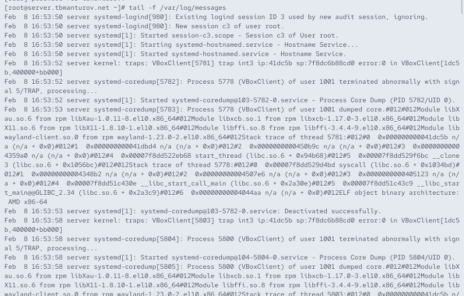{#fig-014 width=70%}

## Просмотр журнала

На сервере под пользователем tbmanturov запустили графическую программу для просмотра журналов: ```gnome-system-monitor``` ([рис. @fig-015]), ([рис. @fig-016])

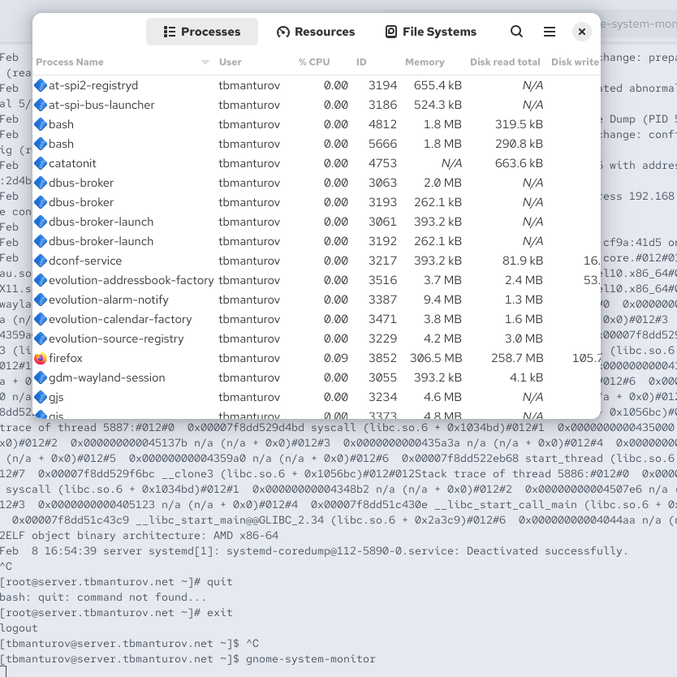{#fig-015 width=70%}

## Просмотр журнала

{#fig-016 width=70%}

## Просмотр журнала

На сервере установили просмотрщик журналов системных сообщений lnav.

{#fig-017 width=70%}


## Просмотр журнала

Далее посмотрели логи с помощью lnav: ```lnav``` ([рис. @fig-022])

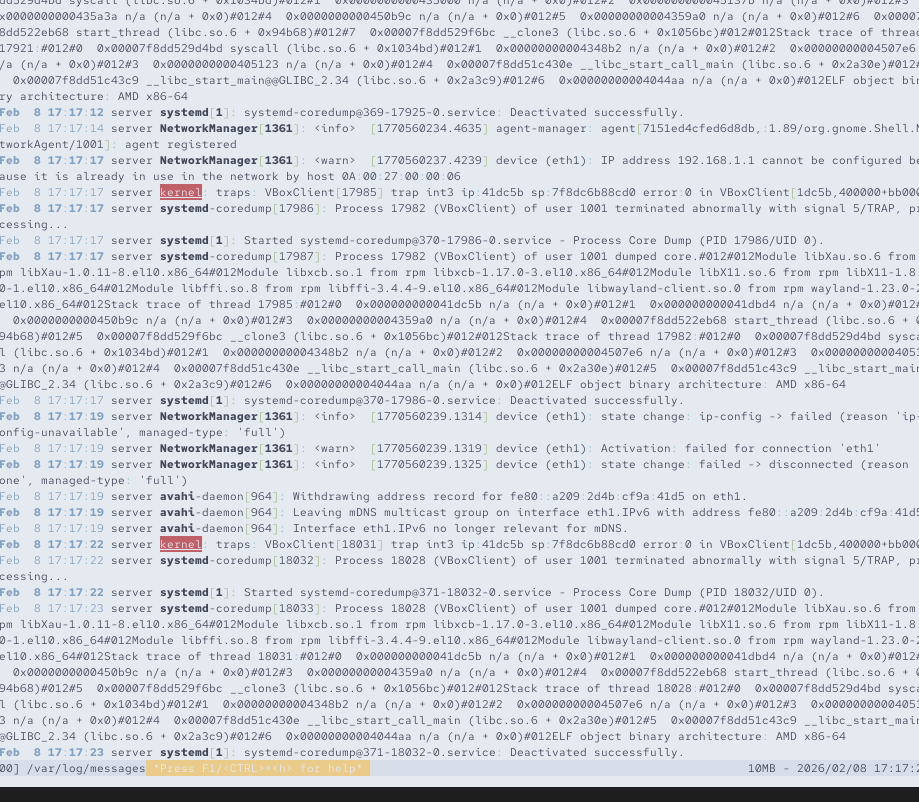{#fig-022 width=70%}

## Просмотр журнала

{#fig-023 width=70%}

## Просмотр журнала

Посмотрели логи на клиенте: ```tail -f /var/log/messages```. Все логи, имеющиеся на клиенте, также отображаются на сервере ([рис. @fig-014])

{#fig-024 width=70%}

## Внесение изменений в настройки внутреннего окружения виртуальной машины

На виртуальной машине server перешли в каталог для внесения изменений в настройки внутреннего окружения */vagrant/provision/server/* и создали в нём каталог *netlog*, в который поместили в соответствующие подкаталоги конфигурационные файлы ([рис. @fig-025]):

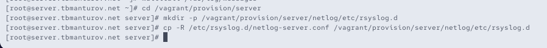{#fig-025 width=70%}

## Внесение изменений в настройки внутреннего окружения виртуальной машины

В каталоге */vagrant/provision/server* создали исполняемый файл netlog.sh ([рис. @fig-026]): 

{#fig-026 width=70%}

## Внесение изменений в настройки внутреннего окружения виртуальной машины

Открыв его на редактирование, прописали в нём следующий скрипт ([рис. @fig-027]):

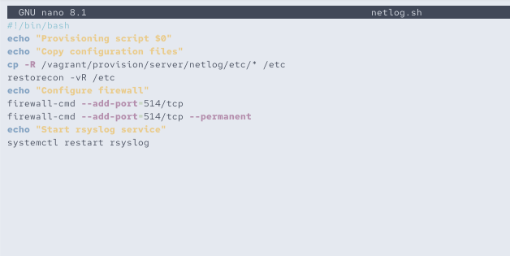{#fig-027 width=70%}

## Внесение изменений в настройки внутреннего окружения виртуальной машины

На виртуальной машине client перешли в каталог для внесения изменений в настройки внутреннего окружения */vagrant/provision/client/* и создали в нём каталог *netlog*, в который поместили в соответствующие подкаталоги конфигурационные файлы ([рис. @fig-028]):

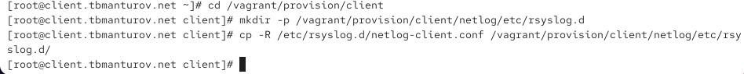{#fig-028 width=70%}

## Внесение изменений в настройки внутреннего окружения виртуальной машины

В каталоге */vagrant/provision/client/* создали исполняемый файл netlog.sh ([рис. @fig-029]): 

{#fig-029 width=70%}

## Внесение изменений в настройки внутреннего окружения виртуальной машины

Открыв его на редактирование, прописали в нём следующий скрипт ([рис. @fig-030]):

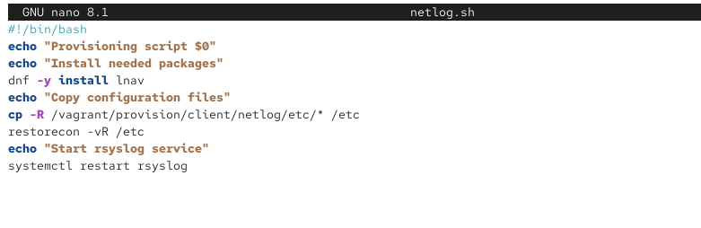{#fig-030 width=70%}

## Внесение изменений в настройки внутреннего окружения виртуальной машины

Для отработки созданных скриптов во время загрузки виртуальных машин server и client в конфигурационном файле Vagrantfile необходимо добавить в соответствующих разделах конфигураций для сервера и клиента ([рис. @fig-031]), ([рис. @fig-032]):

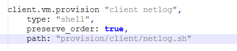{#fig-031 width=70%}

## Внесение изменений в настройки внутреннего окружения виртуальной машины

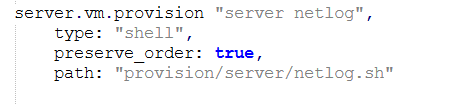{#fig-032 width=70%}

## Внесение изменений в настройки внутреннего окружения виртуальной машины

После этого можно выключать виртуальные машины server и client: ```make server-halt``` и ```make client-halt``` ([рис. @fig-033])

# Подведение итогов

## Выводы

В ходе выполнения лабораторной работы №15 мы получили навыки по работе с журналами системных событий.

## Список литературы

1. [Лаборатораня работа №15](https://esystem.rudn.ru/pluginfile.php/2854790/mod_resource/content/8/015-netlog.pdf)
