---
# Preamble

## Author
author:
  name: Мантуров Татархан Бесланович
  degrees: DSc
  orcid: 0000-0002-0877-7063
  email: kulyabov-ds@rudn.ru
  affiliation:
    - name: Российский университет дружбы народов
      country: Российская Федерация
      postal-code: 117198
      city: Москва
      address: ул. Миклухо-Маклая, д. 6
## Title
title: "Отчёт по лабораторной работе №16"
subtitle: "Дисциплина: Администрирование сетевых подсистем"
license: "CC BY"
## Generic options
lang: ru-RU
number-sections: true
toc: true
toc-title: "Содержание"
toc-depth: 2
## Crossref customization
crossref:
  lof-title: "Список иллюстраций"
  lot-title: "Список таблиц"
  lol-title: "Листинги"
## Bibliography
bibliography:
  - bib/cite.bib
csl: _resources/csl/gost-r-7-0-5-2008-numeric.csl
## Formats
format:
### Pdf output format
  pdf:
    toc: true
    number-sections: true
    colorlinks: false
    toc-depth: 2
    lof: true # List of figures
    lot: true # List of tables
#### Document
    documentclass: scrreprt
    papersize: a4
    fontsize: 12pt
    linestretch: 1.5
#### Language
    babel-lang: russian
    babel-otherlangs: english
#### Biblatex
    cite-method: biblatex
    biblio-style: gost-numeric
    biblatexoptions:
      - backend=biber
      - langhook=extras
      - autolang=other*
#### Misc options
    csquotes: true
    indent: true
    header-includes: |
      \usepackage{indentfirst}
      \usepackage{float}
      \floatplacement{figure}{H}
      \usepackage[math,RM={Scale=0.94},SS={Scale=0.94},SScon={Scale=0.94},TT={Scale=MatchLowercase,FakeStretch=0.9},DefaultFeatures={Ligatures=Common}]{plex-otf}
### Docx output format
  docx:
    toc: true
    number-sections: true
    toc-depth: 2
---

# Цель работы

Целью данной работы получить навыки работы с программным средством Fail2ban для обеспечения базовой защиты от атак типа «brute force».

# Задание

1. Установить и настроить Fail2ban для отслеживания работы установленных на сервере служб
2. Проверить работу Fail2ban посредством попыток несанкционированного доступа с клиента на сервер через SSH
3. Написать скрипт для Vagrant, фиксирующий действия по установке и настройке Fail2ban

# Выполнение лабораторной работы

## Защита с помощью Fail2ban

Загрузили нашу операционную систему и перешли в рабочий каталог с проектом: ```cd /var/tmp/tbmanturov/vagrant``` ([рис. @fig-001])

Запустили виртуальную машину server: ```make server-up``` ([рис. @fig-002]) 

Далее на виртуальной машине server вошли под созданным нами пользователем и открыли терминал. Перешли в режим суперпользователя: ```sudo -i``` ([рис. @fig-003])

На сервере установили fail2ban: ```dnf -y install fail2ban``` ([рис. @fig-004])

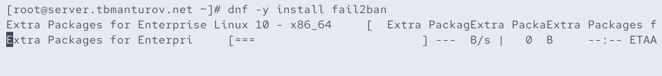{#fig-004 width=70%}

Запустили сервер fail2ban: ```systemctl start fail2ban``` и ```systemctl enable fail2ban``` ([рис. @fig-005])

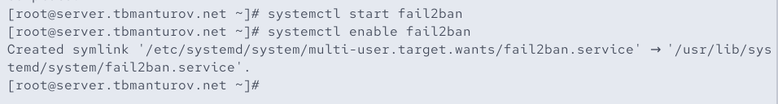{#fig-005 width=70%}

В дополнительном терминале запустили просмотр журнала событий fail2ban: ```tail -f /var/log/fail2ban.log``` ([рис. @fig-006])

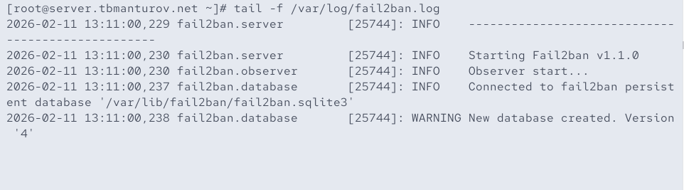{#fig-006 width=70%}

Создали файл с локальной конфигурацией fail2ban: ```touch /etc/fail2ban/jail.d/customisation.local``` ([рис. @fig-007])

В файле */etc/fail2ban/jail.d/customisation.local* задали время блокирования на 1 час и включили защиту SSH ([рис. @fig-008]):

```
[DEFAULT]
bantime = 3600
#
# SSH servers
#
[sshd]
port = ssh,2022
enabled = true
[sshd-ddos]
filter = sshd
enabled = true
[selinux-ssh]
enabled = true
```

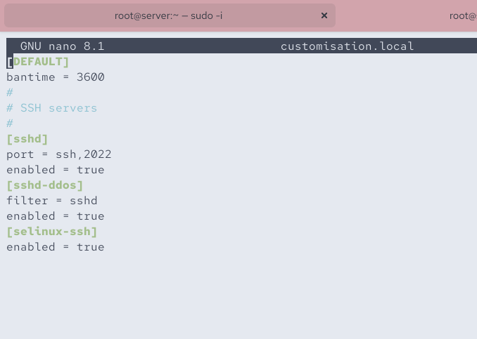{#fig-008 width=70%}

Перезапустили fail2ban: ```systemctl restart fail2ban``` ([рис. @fig-009])

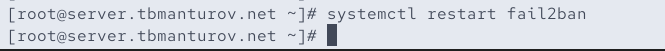{#fig-009 width=70%}

Посмотрели журнал событий: ```tail -f /var/log/fail2ban.log``` ([рис. @fig-010])

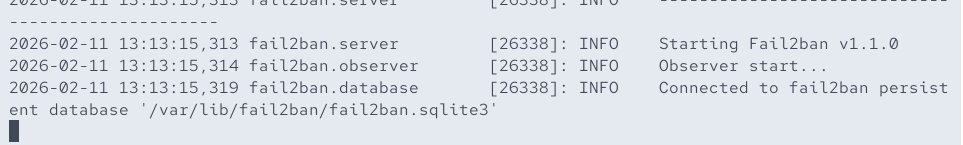{#fig-010 width=70%}

В файле */etc/fail2ban/jail.d/customisation.local* включили защиту HTTP ([рис. @fig-011]):

```
#
# HTTP servers
#
[apache-auth]
enabled = true
[apache-badbots]
enabled = true
[apache-noscript]
enabled = true
[apache-overflows]
enabled = true
[apache-nohome]
enabled = true
[apache-botsearch]
enabled = true
[apache-fakegooglebot]
enabled = true
[apache-modsecurity]
enabled = true
[apache-shellshock]
enabled = true
```

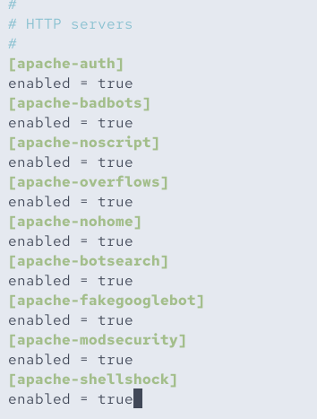{#fig-011 width=70%}

Перезапустили fail2ban: ```systemctl restart fail2ban``` ([рис. @fig-012])

{#fig-012 width=70%}

Посмотрели журнал событий: ```tail -f /var/log/fail2ban.log``` ([рис. @fig-013])

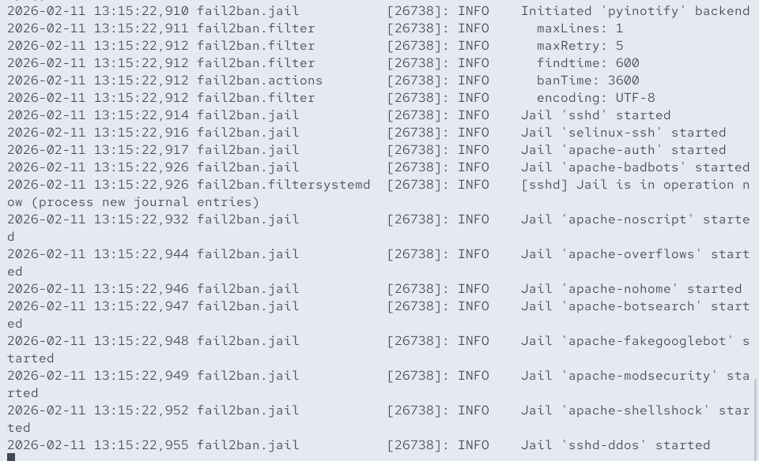{#fig-013 width=70%}

В файле /etc/fail2ban/jail.d/customisation.local включили защиту почты ([рис. @fig-014]):

```
#
# Mail servers
#
[postfix]
enabled = true
[postfix-rbl]
enabled = true
[dovecot]
enabled = true
[postfix-sasl]
enabled = true
```

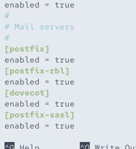{#fig-014 width=70%}

Перезапустили fail2ban: ```systemctl restart fail2ban``` ([рис. @fig-015])

{#fig-015 width=70%}

Посмотрели журнал событий: ```tail -f /var/log/fail2ban.log``` ([рис. @fig-016])

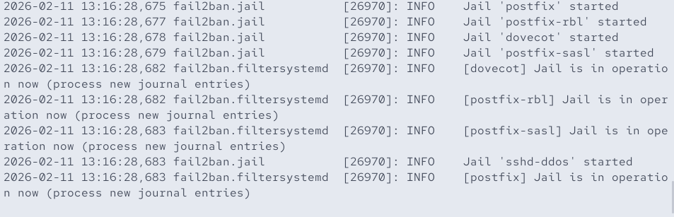{#fig-016 width=70%}

## Проверка работы Fail2ban

На сервере посмотрели статус fail2ban: ```fail2ban-client status``` ([рис. @fig-017])

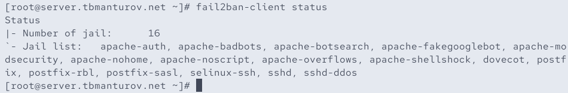{#fig-017 width=70%}

Посмотрели статус защиты SSH в fail2ban: ```fail2ban-client status sshd``` ([рис. @fig-018])

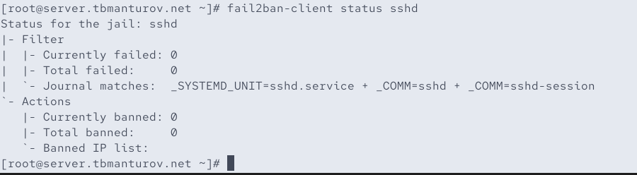{#fig-018 width=70%}

Установили максимальное количество ошибок для SSH, равное 2: ```fail2ban-client set sshd maxretry 2``` ([рис. @fig-019])

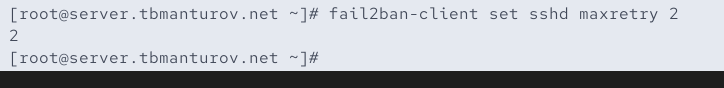{#fig-019 width=70%}

С клиента попытались зайти по SSH на сервер с неправильным паролем ([рис. @fig-020]), ([рис. @fig-021])

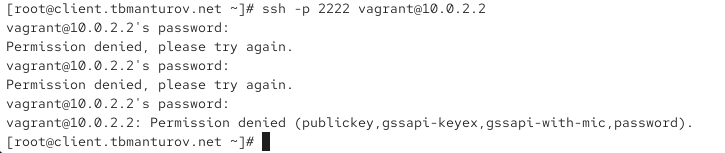{#fig-021 width=70%}

На сервере посмотрели статус защиты SSH и убедились что произошла блокировка адреса клиента: ```fail2ban-client status sshd``` ([рис. @fig-022])

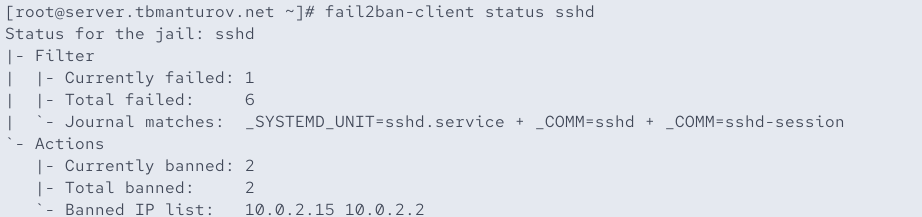{#fig-022 width=70%}

Разблокировали IP-адрес клиента: ```fail2ban-client set sshd unbanip <ip-адрес клиента>``` ([рис. @fig-023])

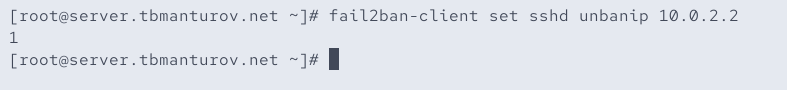{#fig-023 width=70%} 

Вновь посмотрели статус защиты SSH и убедились, что блокировка клиента снята: ```fail2ban-client status sshd``` ([рис. @fig-024])

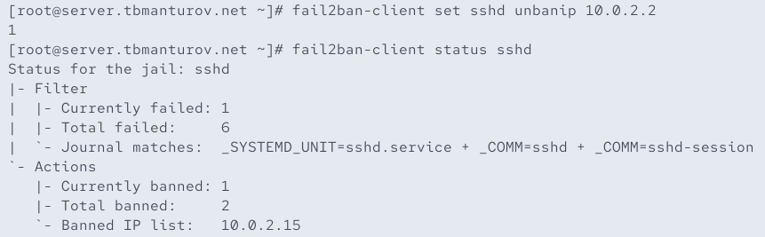{#fig-024 width=70%}

На сервере внесли изменение в конфигурационный файл */etc/fail2ban/jail.d/customisation.local*, добавив в раздел по умолчанию игнорирование адреса клиента ([рис. @fig-025]):

```
[DEFAULT]
bantime = 3600
ignoreip = 127.0.0.1/8 <ip-адрес клиента>
```

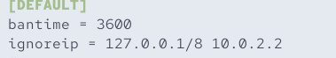{#fig-025 width=70%}

Перезапустили fail2ban: ```systemctl restart fail2ban``` ([рис. @fig-026])

{#fig-026 width=70%}

Посмотрели журнал событий: ```tail -f /var/log/fail2ban.log``` ([рис. @fig-027])

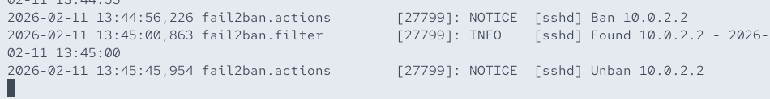{#fig-027 width=70%}

## Внесение изменений в настройки внутреннего окружения виртуальной машины

На виртуальной машине server перешли в каталог для внесения изменений в настройки внутреннего окружения */vagrant/provision/server/* и создали в нём каталог *protect*, в который поместили в соответствующие подкаталоги конфигурационные файлы ([рис. @fig-030]):

```cd /vagrant/provision/server```

```mkdir -p /vagrant/provision/server/protect/etc/fail2ban/jail.d```

```cp -R /etc/fail2ban/jail.d/customisation.local /vagrant/provision/server/protect/etc/fail2ban/jail.d/```

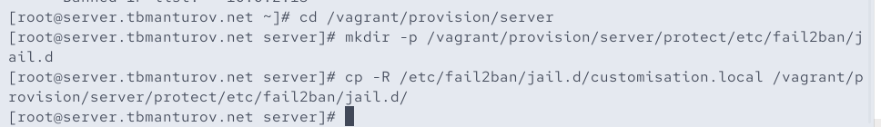{#fig-030 width=70%}

В каталоге */vagrant/provision/server* создали исполняемый файл protect.sh ([рис. @fig-031]): 

```cd /vagrant/provision/server```

```touch protect.sh```

```chmod +x protect.sh```

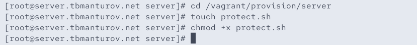{#fig-031 width=70%}

Открыв его на редактирование, прописали в нём следующий скрипт ([рис. @fig-032]):

```
#!/bin/bash
echo "Provisioning script $0"
echo "Install needed packages"
dnf -y install fail2ban
echo "Copy configuration files"
cp -R /vagrant/provision/server/protect/etc/* /etc
restorecon -vR /etc
echo "Start fail2ban service"
systemctl enable fail2ban
systemctl start fail2ban
```

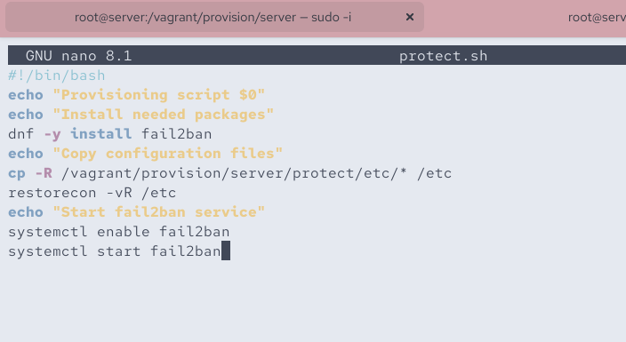{#fig-032 width=70%}

Для отработки созданного скрипта во время загрузки виртуальной машины server в конфигурационном файле Vagrantfile необходимо добавить в соответствующем разделе конфигураций для сервера ([рис. @fig-033]):

```
server.vm.provision "server protect",
	type: "shell",
	preserve_order: true,
	path: "provision/server/protect.sh"
```

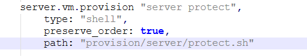{#fig-033 width=70%}

После этого можно выключать виртуальные машины server и client: ```make server-halt``` и ```make client-halt``` ([рис. @fig-034])

## Контрольные вопросы + ответы

1. Поясните принцип работы Fail2ban.

Fail2ban является инструментом для защиты от атак на серверы, основанных на анализе журналов. Он мониторит журналы системы на предмет неудачных попыток входа или других событий, а затем блокирует IP-адреса атакующих с использованием системных средств, таких как iptables. Принцип работы:

- Мониторинг журналов на предмет определенных событий
- Обнаружение повторных неудачных попыток входа или других нарушений
- Динамическое обновление правил брандмауэра для блокировки атакующих IP-адресов


2. Настройки какого файла более приоритетны: jail.conf или jail.local?

Настройки файла jail.local имеют более высокий приоритет и перекрывают настройки из jail.conf. Таким образом, если есть конфликтующие настройки, они будут использоваться из jail.local.


3. Как настроить оповещение администратора при срабатывании Fail2ban?

В файле jail.local нужно указать параметр destemail и задать адрес электронной почты, а также параметр action с указанием определенного действия (например, action_mw для отправки почты).


4. Поясните построчно настройки по умолчанию в конфигурационном файле /etc/fail2ban/jail.conf, относящиеся к веб-службе.

Пример настроек для веб-службы в файле jail.conf:

```
[apache]
enabled = true
port  = http,https
filter = apache-auth
logpath = /var/log/apache*/*error.log
```

5. Поясните построчно настройки по умолчанию в конфигурационном файле /etc/fail2ban/jail.conf, относящиеся к почтовой службе.

Пример настроек для почтовой службы в файле jail.conf:

```
[postfix]
enabled = true
filter = postfix
action = iptables-multiport[name=postfix, port="submission,smtps", protocol=tcp]
```

6. Какие действия может выполнять Fail2ban при обнаружении атакующего IP-адреса? Где можно посмотреть описание действий для последующего использования в настройках Fail2ban?

Fail2ban может выполнять различные действия, такие как блокировка IP-адреса с использованием брандмауэра, отправка уведомлений, добавление в черные списки и т.д. Описание действий можно найти в конфигурационных файлах в разделе action.

7. Как получить список действующих правил Fail2ban?

Командой ```fail2ban-client status```

8. Как получить статистику заблокированных Fail2ban адресов?

Командой ```fail2ban-client status <jail_name>```

9. Как разблокировать IP-адрес?

Командой ```fail2ban-client set <jail_name> unbanip <ip_address>```

# Выводы

В ходе выполнения лабораторной работы №16 мы получили навыки работы с программным средством Fail2ban для обеспечения базовой защиты от атак типа «brute force».

# Список литературы

1. [Лаборатораня работа №16](https://esystem.rudn.ru/pluginfile.php/2854794/mod_resource/content/6/016-protect.pdf)
